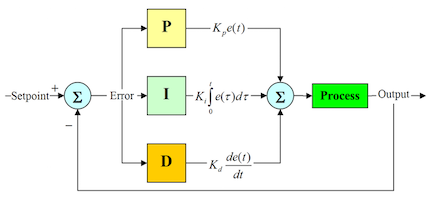

.. _control_index:

Control Systems
===============

Control systems are one of the most important parts of any apparatus. They
take sensor readings and target values, then use actuators to try to
drive the system towards the desired state. Control theory can become complex
very quickly for systems with non-linear response functions or systems with
strict response time requirements. In this section we will cover the
fundamentals of control by examining the most common types of control systems.
(Icon image: `Wikipedia <https://en.wikipedia.org/wiki/File:PID-feedback-loop-v1.png>`_)

Contents:

.. toctree::
   :maxdepth: 1

   control_resources
