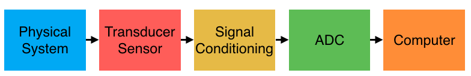

.. _data_acquisition:

Data Acquisition
================

In most apparatus we need to record something about the physical system in a
format to analyze later, commonly digital data. In this section we will examine
how the data acquisition chain works and discuss each part and its role in
making sure you get the best quality and most valid data. Doing data acquisition
incorrectly can result in poor quality data, or data that is incorrectly
sampled, often leading to mis-interpretation.

Physical System
---------------
The physical system is the actual thing we care about measuring and recording.
It generally does not lend itself to direct recording. For example measuring the
displacement of an object or the mass of an object is not natively a digital
process. The most important thing when considering the physical system is
considering how you can attach instrumentation without modifying the behavior of
the system. It is also important to ensure that the system is functioning
correctly and safely.

Transducer/Sensor
-----------------
The transducer or sensor is the device that will turn the physical quantity
(temperature, acceleration, mass, etc) into an electrical signal. Transducers
transform one quantity into another through a well defined transfer function or
calibration. Transducers often use the electrical quantities of voltage,
resistance, or current to encode information about the physical system. We will
go over many transducers in detail later in the course.

Signal Conditioning
-------------------
Most transducers do not produce a signal that is immediately ready to be
recorded. The act of modifying the signal to make it useful and recordable is
known as signal conditioning. Common steps in signal conditioning include
conversion to an easy to measure quantity (i.e. resistance to voltage),
amplification (increasing the amplitude or output range of the signal), and
filtering (cleaning up the signal). Each of these steps has a devoted section
that we will discuss during the course.

Analog-to-Digital Conversion
----------------------------
Once the signal is in an easy to measure quantity (most commonly voltage) and in
the ideal range for your hardware, it is time to convert the information to a
digital quantity that we can store and analyze later. This process is known as
analog-to-digital conversion (A2D or ADC). The process of converting an
continuous quantity (an analog voltage that can have any value) to a digital
representation that much have a discrete number of steps of values, results in a
loss of some information. The resolution of the ADC is generally described in
the number of bits used to represent the analog quantity, with higher bit ADCs
having a finer resolution. The time resolution required should also be
considered. Sampling must be a minimum of twice the maximum frequency of
interest (the Nyquist criteria). In practice it is wise to always sample at
least 5-10 times the maximum frequency of interest to avoid any aliasing issues
and make filtering/decimation an easier process.

Computer/Recording
------------------
The ADC system is generally connected to a computer (embedded or otherwise) to
store the data to a storage media. Often the incoming readings are visualized
in real-time to help the equipment operator and/or used to control the system
being monitored.
