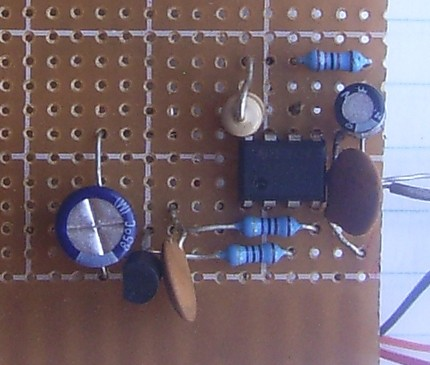
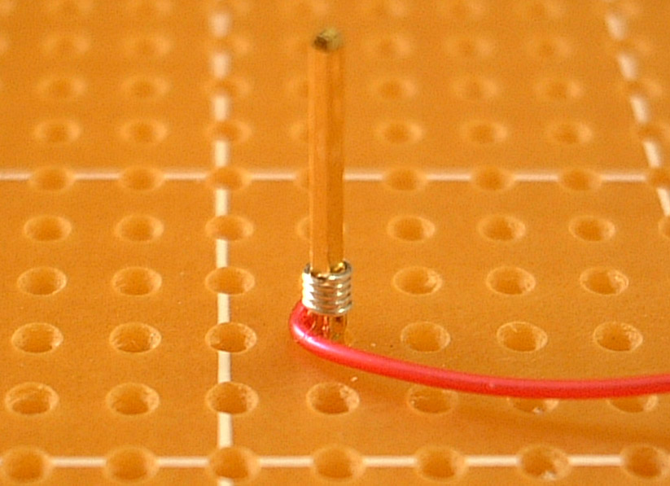

.. _prototyping_techniques:

Prototyping Techniques
======================

When producing electronics for the laboratory, we often need to only make a few
copies of our circuit, making manufacturing on a commercial scale unreasonable.
There are a number of prototyping techniques that can be used to create circuits
that are semi-permanent or permanent. We will cover the basics of each technique
and its unique advantages/disadvantages.

Breadboard
----------

.. figure:: ./images/breadboard.jpg
   :align: right
   :scale: 30 %

   `A small breadboard (Image: Wikipedia) <https://commons.wikimedia.org/wiki/File:400_points_breadboard.jpg>`_

The breadboard is the most versatile way to prototype electronics. A perforated
plastic grid covers copper spring contacts. Components and wires can be pushed
into the holes and the spring contacts make a good, but temporary electrical
connection. Breadboards commonly contain power busses for convenience. Generally
the vertical rows on each side of the center are electrically connected.
Breadboards are useful for the initial prototyping of circuits when the design
is being tested and iterated on often. This type of construction is also useful
for temporary or demonstration circuit construction.

There is some stray capacitance introduced into your circuit when using a
breadboard. Long component legs and any flying jumper wires can be places for
interference to be radiated/received. Breadboards are not suitable for radio
frequency (RF) prototyping, but are often adequate for laboratory circuits.
There are `products on the market <https://commons.wikimedia.org/wiki/File:Wire_Wrapping.jpg>`_
that are placed on top of the breadboard before the circuit is built and allow
you to later remove the components and solder them to a permanent board. This is
suitable for basic circuits with a careful initial circuit layout.

The video below demonstrates the capacitance effect of a breadboard:

.. raw:: html

    

    <iframe width="560" height="315" src="https://www.youtube.com/embed/6GIscUsnlM0" frameborder="0" allowfullscreen>
    </iframe>
    

Perf/Vero Board
---------------

   `A simple circuit constructed on perfboard (Image: Wikipedia) <https://commons.wikimedia.org/wiki/File:555_timer_circuit_perforated_board.jpg>`_

Perf-board or vero-board can be used to create more permanent versions of
circuits. These boards are made of an insulating material with a grid of holes
drilled in it. Some designs have no copper pads or electrical connections, but
many have pads to allow easy soldering and mechanical securing of the
components. Different designs are available with connection patterns between
rows and columns of holes to aid circuit construction with fewer jumpers.

This prototyping technique has many of the same issues as breadboard
prototyping, but is a more permanent construction technique and one of the most
popular. Some technicians prefer to use a tool to cut copper traces on the
bottom of the boards to further increase the number of connections that can be
made without jumpers. Layout of these prototypes requires some planning, but can
make very nice low to mid-frequency circuits.

Manhattan
---------
Manhattan prototyping is commonly used for high frequency and RF circuit
prototyping and construction. A copper clad board is used as a ground plane and
islands are cut or glued on to provide common connection points for components.
Components are often wired in the air even. Keeping leads short is important!
This construction can look messy, but when
`done well <https://aa7ee.wordpress.com/2011/07/24/the-wbr-a-simple-high-performance-regen-receiver-for-40m-by-n1byt/>`_
is an art. There are
products available (like `this kit <http://qrpme.com/?p=product&id=MC>`_ )
that provide glue on solder pads of various size and
footprint, but often scrap bits of copper clad are used. Another way to create
connection islands is with a hollow drill, such as
`this one <http://qrpme.com/?p=product&id=IC>`_.

This technique is named for the skyscraper/skyline look of the components
standing up off the board. When integrated circuits are used, they are often
glued to the board upside down with their pins facing upward. This is referred
to as dead bug construction. This technique is very good at high frequencies,
but can produce a slightly fragile circuit, so an enclosure is recommended.

Wire-Wrap
---------

   `A single wire-wrap connection (Image: Wikipedia) <https://commons.wikimedia.org/wiki/File:Wire_Wrapping.jpg>`_

Wire-wrap uses special wire and a tool to strip, and firmly mechanically bond
the wire to a square post with sharp corners. Wire wrapping is often used to
prototype digital circuits in a semi-permanent way. Modifying wire wrap boards
can become time consuming when many wires are connected to a single post or
there are many overlapping wires. Special sockets for parts are required for
this technique, but it can be a fast way to prototype and was often used in the
design of early computers.

Wire wrapped designs are good for relatively high speed circuits, but not
useable for modern computing speeds or often for low noise analog designs.

.. raw:: html

    

    <iframe width="560" height="315" src="https://www.youtube.com/embed/IXvEDM-m9CE" frameborder="0" allowfullscreen>
    </iframe>
    

Quick-turn PCB
--------------
In the last few years it has become economical to design a custom printed
circuit board (PCB) and have it manufactured. Traditionally, you needed to
produce a large number of boards to work with a manufacturer and the designs
were made with cut tape patterns, called "taping out" a board. Now, computer
design tools make laying out a board a relatively simple process. PCBs can be
created with copper connections on a single side, on both sides, or even with
many layers of copper sandwiched in between layers of insulators. Signals are
passed between layers with holes that are copper plated called vias.

PCBs, when designed correctly, can be used for very high frequency and low noise
designs. Laying out a circuit board takes considerable time, so that should be
considered before setting out in this direction. The price with panel-sharing
services such as `OSH Park <https://oshpark.com>`_ can be as low as $5/sq-in
for a double sided board. Designs are generally made in a few days, but
overnight manufacturing can often be arranged for a significant fee. Be sure to
check the design rules for your manufacturer and set your CAD tool to enforce
them to ensure a working board!

Examples
--------
This video by Alan Wolke shows many excellent examples of the various
electronics prototyping techniques and is packed full of great resources.

.. raw:: html

    

    <iframe width="560" height="315" src="https://www.youtube.com/embed/kH110yjYZ2g" frameborder="0" allowfullscreen>
    </iframe>
    

