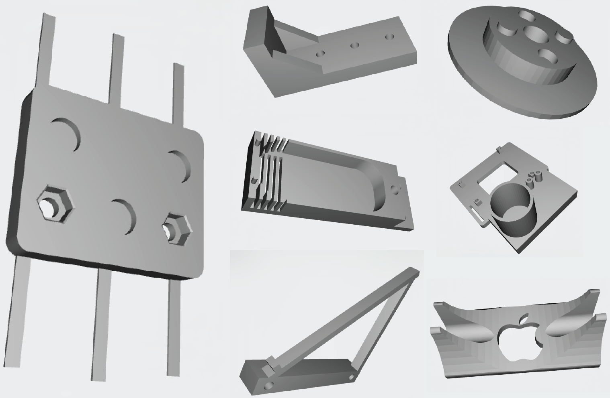

.. _3D_print_activity:

3D Printing Activity
====================

In this activity you will design and print a 3D part. You may take an existing
CAD file from a repository such as
`Thingiverse <http://www.thingiverse.com>`_,
`GrabCAD <https://grabcad.com>`_,
etc. and modify it to
suit your purpose (must be a non-trivial change) or create your own design.
You can make your design in your preferred CAD tool, a few great choices are
`OnShape <https://www.onshape.com>`_,
`OpenSCAD <http://www.openscad.org>`_,
`FreeCAD <http://www.freecadweb.org>`_,
`AutoDeskInventor <http://www.autodesk.com/products/inventor/overview>`_ , and
`SketchUp <http://www.sketchup.com>`_
These can be simple brackets and parts or very complex structures. Be sure to
make something that actually can be 3D printed though - remember the design
concerns we discussed in class. A few examples of CAD files designed for 3D
printing are shown below.

Many universities, public libraries, and maker spaces have 3D printers that
you can use for little or no cost. Penn State operates the
`Maker Commons <(http://makercommons.psu.edu)>`_ as a part of the library
that allows students to print. There are also commercial service bureaus that
will make your print on professional grade machines and ship it to your door.
Of these, `Shapeways <http://www.shapeways.com>`_ seems to have the largest
variety of materials and services. Often service bureaus and library services
can get very busy, so make sure you allow enough time for manufacturing and
shipping!

Grading Rubric
--------------

============================== ==========
Description                    Max Points
============================== ==========
Turned in on time              5
Part created or modified       20
Design for 3D printing         20
Total                          45
============================== ==========
