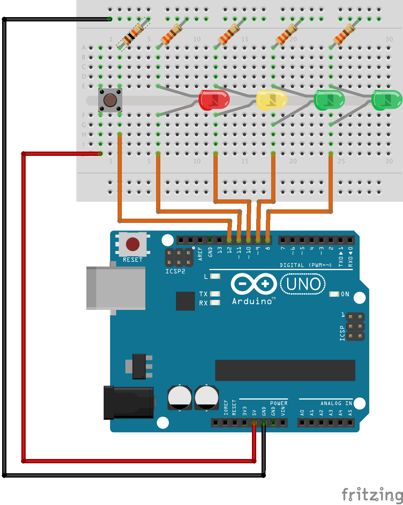
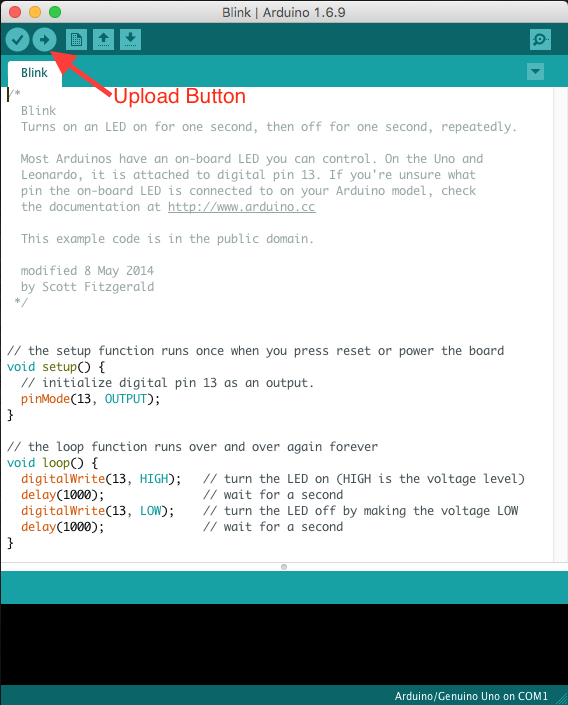

.. _arduino_stoplight:

Arduino Stoplight
=================

.. figure:: ./images/icon_stoplight.jpg
   :align: right
   :scale: 50 %

   Borrowed from `Wikipedia <https://commons.wikimedia.org/wiki/File:Sunnyvale_left_turn_light_2.jpg>`_.

In this activity you will make a simple single stoplight controller with an
Arduino UNO and some LEDs. You will become familiar with using the Arduino
programming environment and learn how to use the General Purpose Input/Output
(GPIO) pins on the microcontroller. You will also practice using good software
design technique by implementing well known design patterns and making
maintainable code.

Materials
---------
* Arduino UNO
* USB Cable
* LEDs (Red, Yellow, Green)
* 330 :math:`\Omega` resistors (Orange-Orange-Brown)
* 10k :math:`\Omega` resistor (Brown-Black-Orange)
* Push button (momentary-on type)
* Breadboard
* M/M Jumper wires
* Computer (Mac, Linux, Windows)

Procedure
---------
1. Download and install the `Arduino IDE <https://www.arduino.cc/en/Main/Software>`_
2. Connect the button, stop, caution, go, and left turn LEDs as shown in diagram.

3. Start the Arduino IDE. Open the Blink example from: *File* :math:`\rightarrow`
   *Examples* :math:`\rightarrow` *01.Basics* :math:`\rightarrow` *Blink*. Read the comments and
   make sure you understand how it works.
4. Connect your Arduino and hit the upload button.
   If it fails, check the board and port settings (in the *Tools* menu). Make
   sure the on-board LED is blinking to show a successful program upload.

5. Change the pin number in the blink example to that of one of your LEDs. Make
   sure that the LED on the breadboard blinks, if not, you need to check the
   connections. Do this for each of the 4 LEDs.
6. Draw a state machine diagram to meet the specifications of the attached
   requirements. Turn this in with the assignment!
7. Build the state machine in the Arduino IDE and test it on your stoplight.
   Your final code should be commented, compile and run, and meet the
   specifications. Be sure to use good coding practices! Your code will be
   tested/graded by an identical Arduino setup.

Requirements
------------
* Begins in the red light state.
* Red light cycle lasts for 3 seconds.
* Yellow light cycle lasts for 1.5 seconds.
* Green light cycle lasts for 3 seconds.
* If a car was present in the left turn lane (simulated by holding down the push
  button) **before** the green light state, add a green left turn light for 2
  seconds. If no car is present, repeat the cycle.
* Uses the state machine implementation with functionalized code. No interrupts allowed!

Grading Rubric
--------------

============================== ==========
Description                    Max Points
============================== ==========
Turned in on time              5
Code Compiles                  20
Meets Project Requirements     40
Total                          65
============================== ==========
