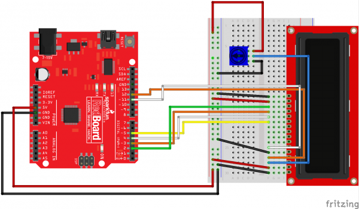

.. _arduino_voltmeter:

Arduino Voltmeter
=================

A voltmeter is a handy tool to measure voltage at different places in the
circuits you are building or troubleshooting. For this class, we didn't get
voltmeters for everyone because we can turn your Arduino into an accurate enough
voltmeter! In this section you will see how to create a four-channel
single-ended or two channel differential voltmeter with the materials in your
inventor's kits.

Materials
---------
* Arduino UNO
* USB Cable
* Computer (Mac, Linux, Windows)
* Jumper Wires
* 16x2 LCD Display
* 10k Potentiometer
* Breadboard

Hookup
------
Follow the hookup diagram for the LCD screen below (click to enlarge):

   `Image: Sparkfun <https://learn.sparkfun.com/tutorials/sik-experiment-guide-for-arduino---v32/experiment-15-using-an-lcd>`_

Single Ended vs. Differential
-----------------------------
You can operate this system in single ended or differential mode. Single ended
means that all measurements are shown with respect to ground (0 volts). In the
single ended mode, connect wires to pins A0, A1, A2, A3. Each of these can then
be used to probe a point in the circuit and display its voltage above ground.

In differential mode, the difference between two of the inputs is displayed, in
this setup we display A1-A0 and A3-A2. This allows us to measure the voltage
difference across components in the circuit. You could of course do this math
mentally, but having it displayed natively is often handy. Connecting A0 and A2
to ground would give you a single-ended like behavior on A1 and A3. Differential
inputs are often used when measuring voltage drops across componets. They are
also generally lower noise as the `common mode noise <http://electronics.stackexchange.com/questions/79752/what-is-common-mode-noise>`_
is greatly reduced.

Useage Notes
------------
It is very likely that the first time you power up this circuit you will not
see anything on the screen. Adjust the potentiometer to change the contrast of
the display until you can read the screen. If it is still not working, check
that you have uploaded the sketch correctly and that all electrical connections
are correct.

Verify the correct operation of your volt meter by measuring the 5V and 3.3V
ports on your Arduino.

Single-Ended Voltmeter Code
---------------------------
.. code-block:: c

    #include <LiquidCrystal.h>

    #define NUM_TO_AVERAGE 500

    LiquidCrystal lcd(12,11,5,4,3,2);

    long a0_value, a1_value, a2_value, a3_value;
    float a0_voltage, a1_voltage, a2_voltage, a3_voltage;

    void setup()
    {
    lcd.begin(16, 2);
    lcd.clear();

    lcd.print("Arduino V Meter");
    delay(2000);
    lcd.clear();
    }

    void loop()
    {

    a0_value = 0;
    a1_value = 0;
    a2_value = 0;
    a3_value = 0;

    for(int i=0; i<NUM_TO_AVERAGE; i++){
      a0_value += analogRead(0);
      a1_value += analogRead(1);
      a2_value += analogRead(2);
      a3_value += analogRead(3);
    }

    a0_voltage = a0_value / NUM_TO_AVERAGE * (5.0/1023);
    a1_voltage = a1_value / NUM_TO_AVERAGE  * (5.0/1023);
    a2_voltage = a2_value / NUM_TO_AVERAGE  * (5.0/1023);
    a3_voltage = a3_value / NUM_TO_AVERAGE  * (5.0/1023);

    lcd.setCursor(0,0);
    lcd.print("0:");
    lcd.print(a0_voltage, 3);

    lcd.setCursor(9,0);
    lcd.print("1:");
    lcd.print(a1_voltage, 3);

    lcd.setCursor(0,1);
    lcd.print("2:");
    lcd.print(a2_voltage, 3);

    lcd.setCursor(9,2);
    lcd.print("3:");
    lcd.print(a3_voltage, 3);

    }

Differential Voltmeter Code
---------------------------

.. code-block:: c

    #include <LiquidCrystal.h>

    #define NUM_TO_AVERAGE 500

    LiquidCrystal lcd(12,11,5,4,3,2);

    long a0_value, a1_value, a2_value, a3_value;
    float a0_voltage, a1_voltage, a2_voltage, a3_voltage;

    void setup()
    {
      lcd.begin(16, 2);
      lcd.clear();

      lcd.print("Arduino V Meter");
      delay(2000);
      lcd.clear();
    }

    void loop()
    {

      a0_value = 0;
      a1_value = 0;
      a2_value = 0;
      a3_value = 0;

      for(int i=0; i<NUM_TO_AVERAGE; i++){
        a0_value += analogRead(0);
        a1_value += analogRead(1);
        a2_value += analogRead(2);
        a3_value += analogRead(3);
      }

      a0_voltage = a0_value / NUM_TO_AVERAGE * (5.0/1023);
      a1_voltage = a1_value / NUM_TO_AVERAGE  * (5.0/1023);
      a2_voltage = a2_value / NUM_TO_AVERAGE  * (5.0/1023);
      a3_voltage = a3_value / NUM_TO_AVERAGE  * (5.0/1023);

      lcd.setCursor(0,0);
      lcd.print("A1-A0: ");
      lcd.print(a1_voltage - a0_voltage, 3);

      lcd.setCursor(0,1);
      lcd.print("A3-A2: ");
      lcd.print(a3_voltage - a2_voltage, 3);
    }
