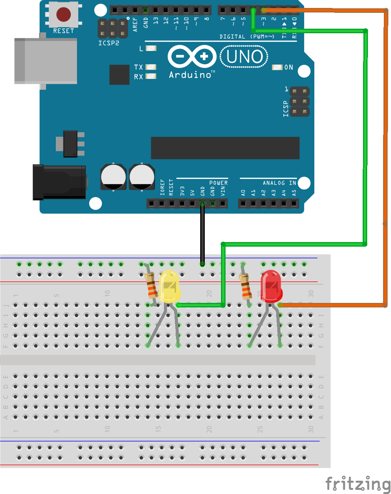

.. _blinky_2.0:

Blinky 2.0
==========

This activity will build on the :ref:`blinky_1.0` activity we did using your
new knowledge of electronics prototyping techniques. We will still blink LEDs,
but we will use external LEDs on a breadboard.

Materials
---------
* Arduino UNO
* USB Cable
* Breadboard
* LEDs (two of your favorite colors)
* 330 :math:`\Omega` resistors (Orange-Orange-Brown)
* M/M Jumper wires
* Computer (Mac, Linux, Windows)

Procedure
---------
* Hook up the LEDs, resistors, and Arduino using the jumper wires and breadboard as shown in the diagram below (click to enlarge).

* LEDs are *polarized* components meaning they have a certain way they need to be in the circuit. On LEDs the short leg next to the flat edge is the ground (-) connection.

* You will need to bend the legs of the resistors to use them on the breadboard, you can do this with your hands or small pliers.

* Based on the code we used in the :ref:`blinky_1.0` activity, write a new program that blinks the LEDs in an alternating pattern.

* Get creative. What patterns can you make? Can you add more LEDs or change the pin assignment for each LED?
