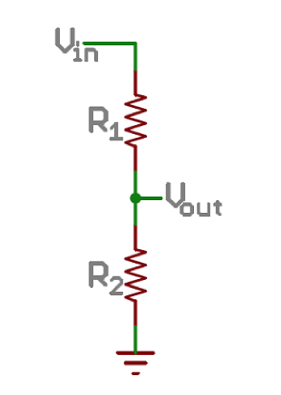

.. _component_basics_activity:

Component Basics
================

In this activity you will gain experience with basic electric circuit analysis
and working with sensors. Part of the activity will be done in teams of two and
the other sections will be completed individually.  Start on the Teamwork
activities (items 1-8) and complete the individual work (items 9-12) afterward.
Each student should turn in a complete assignment/report. Resistors A and B will
be given out in class.

Materials
---------

Tasks
-----
1. Each team will build a voltmeter with one Arduino board and use it to analyze
   circuits built on their second board. Start by completing the
   :ref:`arduino_voltmeter` activity. Show us your group's working Arduino
   voltmeter in class or include a photo of it with your homework submission.

|

2. Using your Arduino voltmeter, determine the resistance of Resistors A & B,
   briefly describe your method. Include a sketch of your circuit if necessary.

|

3. Derive an equation for the Voltage at Vout in the sketch below. Build this
   circuit with R1=Resistor B and R2 as your 10k potentiometer. Measure the range
   of voltage at Vout for Vin = 1.67 V. Briefly describe your methods.

|

4. Now configure a circuit as shown below, where R1 is Resistor A, R3 is
   Resistor B, all other resistors are 330 :math:`\Omega`. Connect 5 V to A and
   ground at B. Label the currents in each leg of the circuit and
   write out the equations for the current loops. Use your equations to determine
   the voltage at each junction relative to ground. Finally, measure the voltage
   at each junction and comment on the comparison between your predictions and
   the measured values.

|

5. Now change R2 to the 10k potentiometer. What is the range of voltage
   you can measure at J3 by sweeping the potentiometer through its entire
   range?

|

6. Set up the wiring for a blinking LED and use your 10k potentiometer to
   control the blinking rate. Write the voltage to the serial monitor at the
   same rate that your LED is blinking.  Start with this code fragment and
   produce a **fully commented** code to solve the problem.

|

.. code-block:: c

    int sensorPin = 0;    // Connect the pot to analog pin 0
    int ledPin = 13;      // Connect the LED to digital pin 13

    void setup() {
        pinMode(ledPin, OUTPUT);
        Serial.begin(9600);
    }

    void loop() {
        int sensorValue;

        sensorValue = analogRead(sensorPin);

        Serial.print("Pot. output value is: ");
        Serial.println(sensorValue);

        digitalWrite(ledPin, HIGH);
        delay(sensorValue);
        digitalWrite(ledPin, LOW);
        delay(sensorValue);
    }

|
|

7. What happens when you vary the position of the pot?  Measure the voltage with
   your Arduino Voltmeter and compare it to those values.

|

8. Convert the output that you measure from the pot. (sensorValue) to voltage.
   Include this in your code with a brief explanation of the conversion.

|

9. Build a thermometer using the TMP36 temperature sensor. You may find the
   `datasheet <http://www.analog.com/media/en/technical-documentation/data-sheets/TMP35_36_37.pdf>`_
   helpful. Complete the wiring and write the code from scratch, without using
   any resources on-line or otherwise.  This activity should be done
   individually. Your code should include detailed comments about all steps of
   the process. For an example of the expectations for your documentation, see
   the Ping code example in *File -> Examples -> Sensors -> Ping*.

|

10. What is the output voltage of the TMP36 at 25 :math:`^\circ` C (room
    temperature)? Can you verify what the room temperature is with a separate
    thermometer for a more accurate assessment?  Measure the output voltage
    yourself and comment on the comparison of your value with the manufacturer’s
    specs.

|

11. What is the expected (and maximum) excitation voltage for the TMP36?  Our
    Arduino has a standard 5V output.  What would happen if you powered the
    TMP36 with 1 V rather than 5?

|

12. Set up a simple calibration with two known temperatures (room temperature
    and your skin temperature for example). Use the serial monitor to measure
    temperature as a function of output voltage from the TMP36. Use the serial
    plotter (found in the *Tools* menu) to plot temperature vs. time. Collect
    some data and plot temperature vs. output voltage. Comment on the comparison
    of your measurements with the manufacturer’s specs.

|

**Due: 10/20/16** A summary with plots, answers to all questions, sketches of
your wiring diagrams, and your code (make sure to name your files
appropriately).
