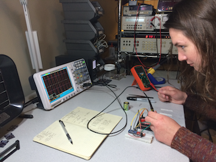

.. _labs_index:

Lab Exercises
=============

The only way to learn about building things is to build things! Follow along
with these laboratory exercises to help you practice the new information you've
learned along the way and build something useful.

Contents:

.. toctree::
   :maxdepth: 1

   blinky_1
   project_brainstorm
   part_manufacture
   threading_activity
   blinky_2
   project_proposal
   flex_data_acquisition
   3D_print_activity
   arduino_stoplight
   state_machine_XRD
   digital_representation
   mechanical_drawing_activity
