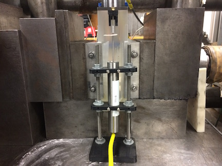

.. _mechanical_design_activity:

Mechanical Design Activity
===========================

We are going to design a simple part using the online CAD tool
`OnShape <https://www.onshape.com>`_ . There are a variety of other tools
available for you to use, but OnShape is online so we don't need to worry about
getting a package installed on everyone's machines. While designing our part,
we will consider what we just learned about design for 3D printing and the
best practices of modern parametric CAD.

We will be designing a holding system for a direct current displacement
transducer (DCDT). This setup has a few parts and we will design as much as we
can in class. You are encouraged to keep working on and finish the design on
your own, but it is not a requirement. The completed parts from this design
activity have been built and are currently in regular laboratory use.

   DCDT brackets in use during a rock mechanics experiment.

If you need reminders of how to do things in OnShape, be sure to checkout their
website that has a lot of great tutorials, webcasts, and other resources. You
can also watch the lecture video in which we go through the design in class.

|
|
|
|
|
