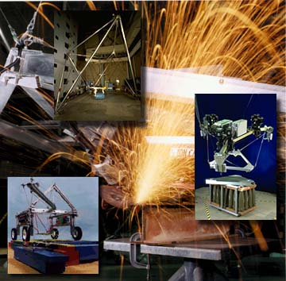

.. _part_manufacture:

Part Manufacturing Techniques
=============================

   Image: `Wikipedia <https://commons.wikimedia.org/wiki/File:Robocrane_Project.jpg>`_.

We've discussed the many ways that parts and assemblies are manufactured. Get
a few different parts and objects from your everyday environment. Describe and
discuss how they are made. Look for clues like the surface finish of the part,
what material it is made of, and where mechanical movement and wear happens.

Questions
---------

* What techniques were used to create the part? Why?
* What fasteners were chosen? Why?
* What is the part made of? Why?
