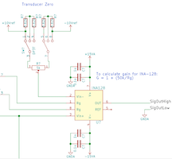

.. _project_brainstorm:

Project Brainstorm
==================

The course project should help you solve a research problem you are facing while
helping you actively learn many of the skills introduced in this course. The
best way to learn is through trail and error - there is sure to be a lot of both
during your project. We would like to help you define a project that is within
the scope of the course and the semester time limit on the work. A good project
will have several characteristics:

* Uses multiple disciplines we discuss (i.e. mechanical, electrical, software, etc.)
* Solves a problem with no commercial solution or no economical commercial solution.
* Will not cost thousands of dollars to build  Does not put you or others in the path of potential harm or danger. 

Brainstorm 5 potential project ideas.

Contents:

.. toctree::
   :maxdepth: 1
