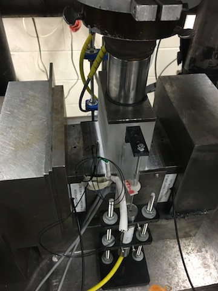

.. _thermistor_calculation:

Thermistor Calculation Activity
===============================

In this activity you will learn how to calculate temperatures measured by a
thermistor in a simple resistive divider circuit. The data were collected at
around room temperature on a frictional shearing experiment. As the experiment
was sheared, some heat was generated. Calculate the time-series of the
temperature throughout the experiment. The data collection rate is one sample
per second.

|
|
|
|
|

Questions
---------
1. The thermistor part number B57861S103A39 was used in this experiment. Download the
   datasheet below and find the :math:`B_{25/100}` and :math:`R_{25}` values
   for this part. What are they? (2 pts.)

   |
   |

2. Calculate the resistance of the thermistor for the time series data. Is the
   mean above or below the :math:`R_{25}` value? What does that tell you about
   the expected temperatures values? (4 pts.)

   |
   |

3. Calculate the temperature of the thermistor for the time series data. What
   are the maximum and minimum values? (4 pts.)

   |
   |

4. Make a plot of the time series of temperature. Assume that the data were
   collected at one sample per second. (2 pts.)

   |

Data
----
:download:`thermistor_data.txt<thermistor_data.txt>`

:download:`Datasheet<B57861_Rev_Dec2010.pdf>`
