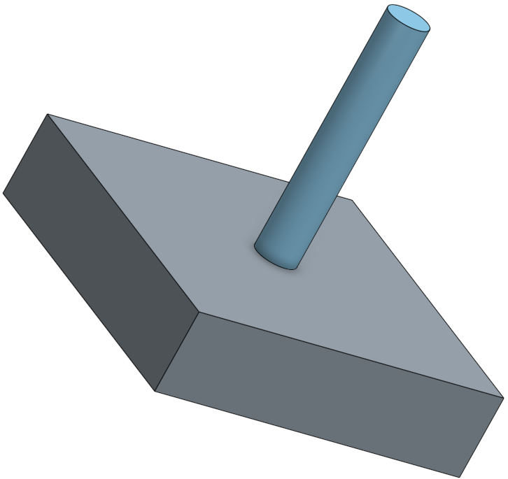

.. _threading_activity:

Threading Activity
==================

In this activity you will practice drilling and tapping, and well as threading
with a die. Cutting threads is a technique used over and over again to provide a
way to secure parts together in a firm, but removable way. Be sure
to follow proper safety and personal protective equipment procedures!

Materials
---------
* 6061 Aluminum plate (2"x2"x0.5" cut from `McMaster 8975K74 <http://www.mcmaster.com/#8975k74/=13kgygi>`_)
* 6061 Aluminum rod (0.25"x2" cut from `McMaster 8974K22 <http://www.mcmaster.com/#8974k22/=13kgyqx>`_)
* 1/4"-20 Through-Hole Tap (`McMaster 26955A43 <http://www.mcmaster.com/#26955a43/=13kgz08>`_)
* 1/4"-20 Right Handed Die (`McMaster 2576A451 <http://www.mcmaster.com/#2576a451/=13kgz5j>`_)
* #7 Twist Drill (`McMaster 29045A727 <http://www.mcmaster.com/#29045a727/=13kgzc1>`_)
* #4 Centerdrill (`McMaster 2915A14 <http://www.mcmaster.com/#2915a14/=13kgzhk>`_)
* Tap driver (`McMaster 2546A23 <http://www.mcmaster.com/#2546a23/=13kgzmt>`_)
* Die handle (`McMaster 25565A21 <http://www.mcmaster.com/#25565a21/=13kgzsc>`_)
* Deburring tool (`McMaster 4289A35 <http://www.mcmaster.com/#4289a35/=13kgzws>`_)
* Cutting lubricant (Crisco, Tap Magic, etc.)

Procedure
---------
#. Layout and mark the center of the plate for drilling.
#. Using the center drill, make a pilot mark for the final drill. Do not drill through the material!
#. Drill the hole to its final diameter (#7). Drilling a smaller pilot hole first is recommended.
#. Deburr both sides of the hole.
#. Lubricate the hole and tap, then tap the hole being careful to get a straight start.
#. Mark the thread depth on the rod so that it will fully screw into the newly tapped hole, but not stick out of the back side of the plate.
#. Using the die and lubricant, thread the rod.
#. Assemble the parts, write your name, and turn it in!
