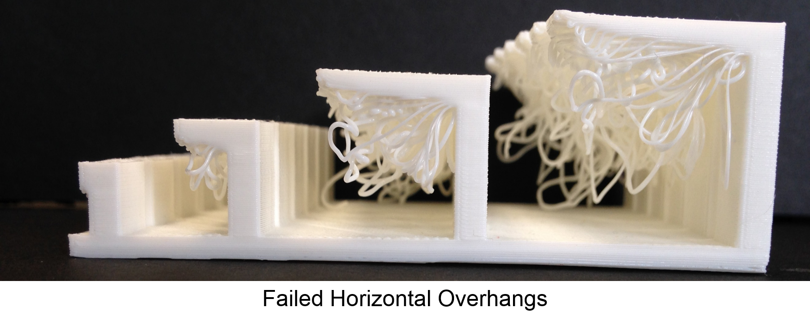
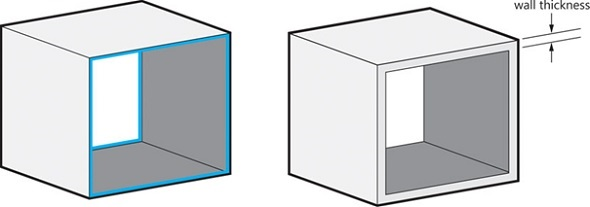
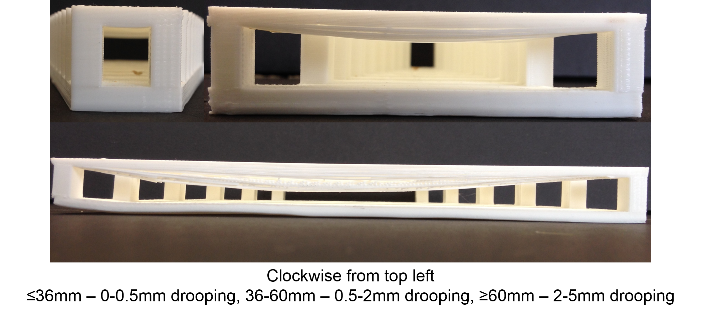
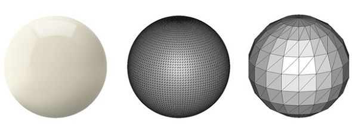
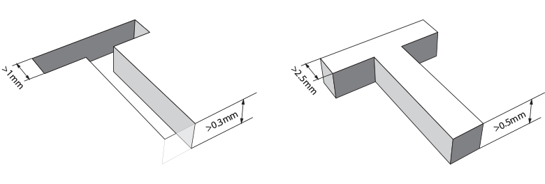
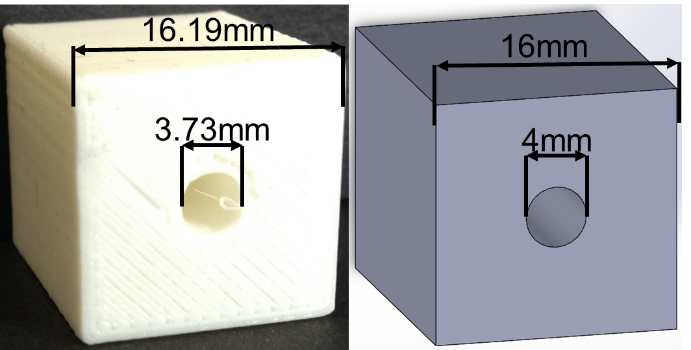

.. _design_3D_printing:

Design for 3D Printing
======================

When designing a piece of laboratory gear, there are many factors that have to
be considered. This is even more true when the parts will be 3D printed as
prototypes or as the final product. Due to the unique way that 3D printing
produces parts, it imposes a special set of design constraints as well as a few
design freedoms that may not be easily translated into a fully machined part.
In this section we will go over some of these concerns and see how they are
often addressed in the design and printing stages.

Overhangs
---------
Any parts with overhang angles greater than 45 degrees from vertical should be
supported or the print will most likely fail. External software generated
supports may be added, or the designer may place temporary supports that are
cleaned away after printing. It is also common to design permanent supports
into the part that reduce any overhang angles to be less than 45 degrees.
Using gussets and other features is a common way to accomplish this task.
Printing a `test piece <http://www.thingiverse.com/thing:858835>`_ is useful
to get a feel for what your printer can do.

   `(Image: utexas.edu) <https://innovationstation.utexas.edu/tip-design/>`_

Layer Stress
------------
3-D printed models are the weakest along the boundary between layers. Any parts
that are expected to experience stress should be oriented such that the maximum
stress is perpendicular to the printing layers (commonly called the z-axis).

.. figure:: ./images/3d_anisotropy.png
   :align: center
   :scale: 80 %

   Anisotropy of 3D print strength `(Image: i.materialise.com) <https://i.materialise.com/blog/how-to-get-the-perfect-wall-thickness-when-turning-your-3d-model-into-a-3d-print/>`_

Wall Thickness
--------------
Too thick or too thin of a wall thickness on 3-D printed parts is a common
failure mode and can increase the price of printing the part dramatically. Walls
less than 1 mm thick are often weak, brittle, and print poorly. Walls thicker
than several millimeters, are often unnecessary and are a waste of print time
and material. Both of these increase the cost of the 3-D print significantly.

   3D Print Wall Thickness `(Image: i.materialise.com) <https://i.materialise.com/blog/how-to-get-the-perfect-wall-thickness-when-turning-your-3d-model-into-a-3d-print/>`_

Bridges
-------
Anytime the printer must print over open air is referred to as a bridging
print. Bridging of more than a few centimeters often fails and results in sag of
the print material. It is common for a 3-D print service bureau to be able to
tell you what their maximum reliable bridging distance is. You can also do a
bridging `test print <http://www.thingiverse.com/thing:858835>`_ on your own 3-D
printer to see what constraints you should follow.

   `(Image: utexas.edu) <https://innovationstation.utexas.edu/tip-design/>`_

Part Clearance
--------------
When designing parts that are meant to fit together, some clearance must be
allowed. To allow a free fit of parts, a clearance of 0.015-0.020" is often
enough. When designing parts for a close fit, a tolerance of 0.005-0.010" is
generally adequate.

Resolution
----------
When exporting your model to a stereolithography file for printing, make sure an
adequate resolution has been selected. Too low of a resolution will result in
prints that are angular and do not represent the shape you desired. More
complicated models will take more time to slice and process, but will be a
better representation of your 3-D model.

   Text engraved (left) and embossed (right) `(Image: i.materialise.com) <https://i.materialise.com/blog/5-mistakes-to-avoid-when-designing-a-3d-model-for-3d-printing/>`_

Text
----
Adding text to a 3-D print is a great way to label front panels, personalize an
object, or make the user experience more intuitive. Text can either be engraved
with  letters recessed into the part, or embossed with raised lettering. Using
engraved text is highly recommended because embossed text often has features
that are too small at reasonable font sizes and result in failed prints.
Engraved text also doesn't leave material sticking up from the top of the part
free to catch things and possibly be sheared off.

   Text engraved (left) and embossed (right) `(Image: i.materialise.com) <https://i.materialise.com/blog/how-to-get-the-perfect-wall-thickness-when-turning-your-3d-model-into-a-3d-print/>`_

Dimensional Accuracy
--------------------
Every 3-D printer has an accuracy specification in XY and generally a separate
specification in the Z. You should consider these accuracies and the thermal
contraction of the plastic if your part requires precise dimensional accuracy.
There are several empirical formulas that have been developed for holes oriented
horizontally or vertically in 3-D printed parts. It is easy enough to print a
calibration print on your printer and create your own equation for your printer.
Designing parts with enough tolerance in mind is generally possible though as
3-D printed assemblies are not specified to nearly as tight tolerance as
machined parts. Also consider printing the part in a different orientation to
get the highest dimensional accuracy where required. You can even split up the
part into multiple pieces and assemble them after printing.

   Dimensional output of the printer (left) compared to the solid model (right) `(Image: utexas.edu) <https://innovationstation.utexas.edu/tip-design/>`_

Model Verification
------------------
Your 3-D printed model could have errors when exported depending on your CAD
package. Is important to be sure that the model is watertight and that no
remaining internal geometry is left from doing Boolean operations on different
shapes. Going through the sliced version of the model and looking for any
incorrect internal geometries is highly recommended. Checking the generated mesh
is easily accomplished with tools such as `Netfabb <https://www.netfabb.com>`_
or other printing and slicing software.

Internal Features
-----------------
3-D printing allows you to design internal features and passageways that can be
completely hidden from the outside, have bends internally, or embed other
complex structures into the part. If your part will be machined by traditional
processes at a later time, it is important to consider that these operations may
not be easily achievable. Always design with the process that will generate the
final part in mind.
