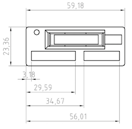

.. _mechanical_index:

Mechanical
==========

Mechanical design of parts and machines can be one of the most challenging
aspects of apparatus design. Over designing results in wasted material and
increased cost, under designing can result in dangerous failures that ruin
your experiment and could cause serious harm. In this section we will learn
the basic principles of sound mechanical design, how to draw your designs so
that a machine shop can understand them, how modern 3D design work is done.

Contents:

.. toctree::
   :maxdepth: 1

   screws
   threads
   rivets
   pins
   retaining_rings
   design_3D_printing
   thin_wall_pressure_vessel
   thick_wall_pressure_vessel
   bending_forces
