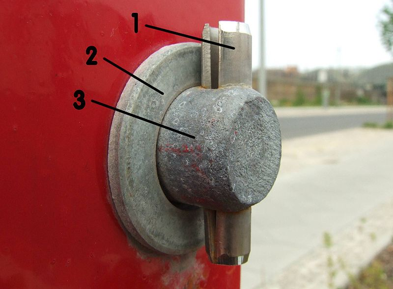
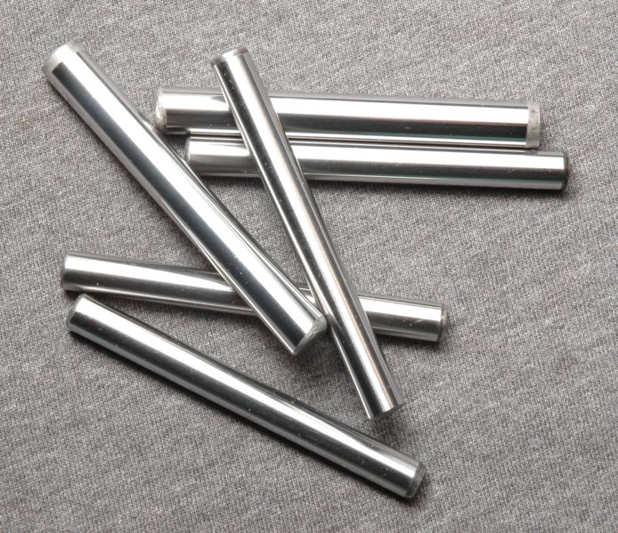
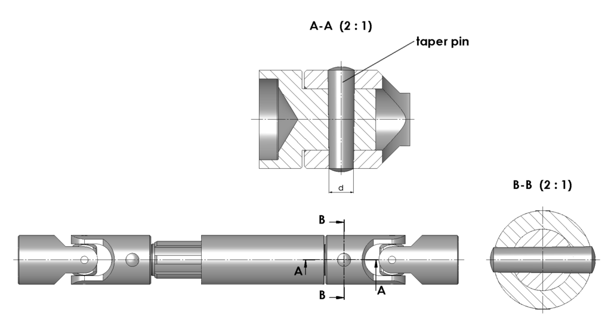
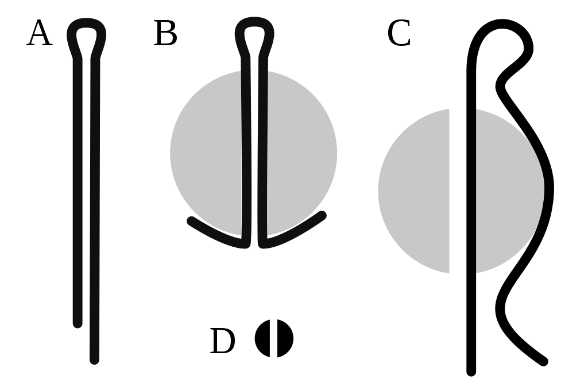
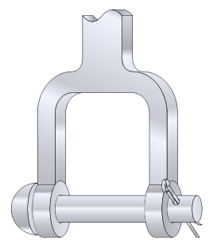

.. _pins:

Pins
======

Pins are used to hold two parts together, sometimes allowing there to be a pivot
point, while other times holding the parts fast. There are several methods of
pinning parts that we will cover here.

Spring Pins
-----------

   `A spring pin (Image: Wikipedia) <https://commons.wikimedia.org/wiki/File:Spring-type_slottet_straigt_pin_labeled_num.jpg>`_

Spring pins, also called roll pins, are self-retaining pins. They are under
double shear since their middle section is experiencing shear forces in the
opposite sense of those at the ends of the pins. Spring pins have a split
along their length and are made to be driven into a hole slightly smaller than
their outside diameter. The compression of the pin makes it secure it the hole
with no other fasteners.

Dowel Pins
----------

   `Steel dowel pins (Image: Wikipedia) <https://commons.wikimedia.org/wiki/File:Steel-Dowel-Pins.jpg>`_

Dowel pins are primarily used to ensure proper alignment of parts as they are
assembled when the loose alignment provided by bolts and screws in insufficient.
The dowel pins can freely slide into a hole on a mating part or be slightly
oversized so that they must be driven or pressed in. Such interference fits are
a semi-permanent to permanent installation technique. There are a number of
standards for dowel construction, including military, DIN 6325, and ISO 2338.

Taper Pins
----------

   Taper Pin (Image: `Wikipedia <https://commons.wikimedia.org/wiki/File:Taper_pin_ISO2339_application_en.png>`_)

Taper pins are very similar to dowel pins, except that they are slightly smaller
on one end. Imperial sized pins generally have a 1:48 taper and metric pins a
1:50 taper. They are driven into place and are commonly used to hold
interlocking shaft assemblies together.

Split Pins
----------

   `Split Pins (Image: Wikipedia) <https://en.wikipedia.org/wiki/Split_pin#/media/File:CotterPins.svg>`_

Split pins are slightly differently defined depending on your locale. In the US
a split pin is a crimped wire that slides into a hole through a part (commonly
a shaft) and over it like that shown in example C. What the rest of the
world calls a split pin, the US knows as a cotter pin or cotter key. This
fastener is placed through a hole and then its legs bent outward to secure it
like that shown in example B.

Clevis Pins
-----------

   `Clevis fastener assembly (Image: Wikipedia) <https://commons.wikimedia.org/wiki/File:Clevis.svg>`_

Clevis pins are used with a shackle and another securing pin (often a split pin)
to provide lateral restraint, but allow rotation and movement in one direction.
Clevis fastening systems are often found in rigging, aerospace, and other heavy
duty control/actuation applications.

|
|
|
|
|
