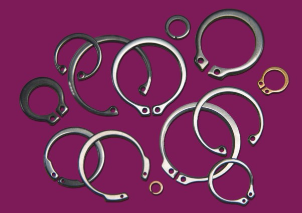

.. _retaining_rings:

Retaining Rings
===============

Retaining rings are placed in grooves to hold parts onto a shaft or into another
part such as a housing. There are a wide variety of speciality retaining rings
for special applications, but the most common are axial and radial retaining
rings. You may hear these called circlips or snap rings as well. There are
special tools available to help with the installation of retaining rings.

Axial Rings
-----------

   `Axial retaining rings (Image: Wikipedia) <https://commons.wikimedia.org/wiki/File:Axial_Rings.jpg>`_

These rings are installed into grooves on a shaft or in a housing by compressing
or expanding them with special pliers and then slipping them over the end of the
parts and releasing the pliers.

Radial Rings
------------

.. figure:: ./images/radial_rings.jpg
   :align: center
   :scale: 30 %

   `Radial retaining rings (Image: Wikipedia) <https://commons.wikimedia.org/wiki/File:Radial_Rings.jpg>`_

Radial rings are slipped over the side of a shaft into a machined groove. There
are special tools available for installation, but often a simple pair of locking
pliers is used for installation and removal. A variant of these called "e-clips"
is often found in assemblies as well.

.. raw:: html

    

    <iframe width="560" height="315" src="https://www.youtube.com/embed/wwxsMj8Jgl0" frameborder="0" allowfullscreen>
    </iframe>
    

.. raw:: html

    

    <iframe width="560" height="315" src="https://www.youtube.com/embed/BDcSsBqt9NI" frameborder="0" allowfullscreen>
    </iframe>
    

|
|
