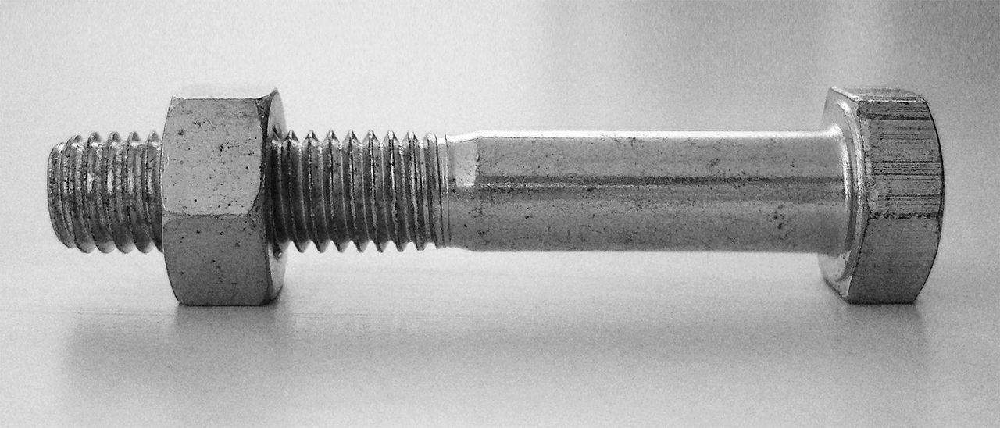
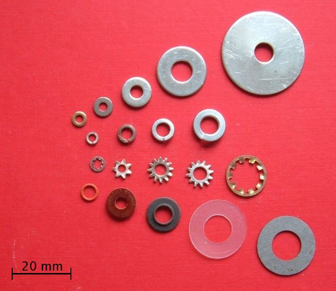

.. _screws:

Screws/Bolts
============

   `Nut and Bolt (Image: Wikipedia) <https://commons.wikimedia.org/wiki/File:Bolt-with-nut.jpg>`_

Screws and bolts are used to hold together to parts by pressing them together
and sometimes threading directly into one of the parts. The two terms are often
used in an ambiguous way as the distinction is poorly defined. There is even a
US Customs document `"Distinguishing Bolts from Screws" <https://www.cbp.gov/sites/default/files/assets/documents/2016-Apr/icp013_3.pdf>`_
Both are threaded fasteners, but distinctions are often made based on the size
and use of the fastener. There are many types of screws listed on the
`Wikipedia screw page <https://en.wikipedia.org/wiki/Screw>`_

Screws and bolts hold firmly against shear and tension on the parts. Some
shoulder bolts or most long bolts have an unthreaded section to reduce the
fretting of unthreaded sections of parts and/or allow a pivot point. Bolts are
made in a variety of grades that represent different strengths. Markings on the
head indicate the grade and can be looked up in a
`grade table <http://www.engineeringtoolbox.com/steel-bolts-sae-grades-d_1426.html>`_

   `Wahsers (Image: Wikipedia) <https://commons.wikimedia.org/wiki/File:Washers.agr.jpg>`_

It is common to use screws and bolts with buts for parts with a clear-fit hole.
`Washers <https://en.wikipedia.org/wiki/Washer_(hardware)>`_
are used to distribute the load and reduce surface deformation. Locking
washers and prevent the assembly from loosening with vibration and use.
Compounds such as `Loctite <http://www.loctite.com>`_ are also often used to
lock threaded fasteners.

|
|
|

**Overview of Screws and Bolts:**

.. raw:: html

    

    <iframe width="560" height="315" src="https://www.youtube.com/embed/R3w2XWOwYS8" frameborder="0" allowfullscreen>
    </iframe>
    

**Nuts and Washers:**

.. raw:: html

    

    <iframe width="560" height="315" src="https://www.youtube.com/embed/I59iO1XPTVw" frameborder="0" allowfullscreen>
    </iframe>
    

**Thread Locking:**

.. raw:: html

    

    <iframe width="560" height="315" src="https://www.youtube.com/embed/oP4KGKEJM8Y" frameborder="0" allowfullscreen>
    </iframe>
    

