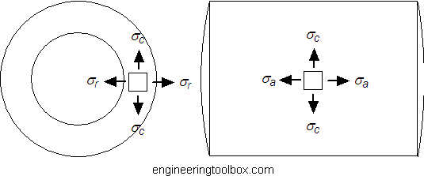

.. _thick_wall_pressure_vessel:

Thick Walled Pressure Vessels
=============================

   Image: `Engineering Toolbox <http://www.engineeringtoolbox.com/stress-thick-walled-tube-d_949.html>`_.

A thick walled pressure vessel is generally considered to be one whose walls
are greater than about 1/10 or 1/20 of the radius of the vessel. The formulas
provided below are for reference and calculation, but before constructing a
real pressure vessel you should check with an engineer. The information is
provided for your reference. Remember that a catastrophic failure of a vessel
could result in serious injury or death.

Axial Stress
------------
:math:`\sigma_a = \frac{p_i r_i^2 - p_o r_o^2}{r_o^2-r_i^2}`

Circumferential (Hoop) Stress
-----------------------------
:math:`\sigma_c = \frac{p_i r_i^2 - p_o r_o^2}{r_o^2 - r_i^2} - \frac{r_i^2 r_o^2(p_o - p_i)}{r^2(r_o^2-r_i^2)}`

Radial Stress
-------------
:math:`\sigma_r = \frac{p_i r_i^2 - p_o r_o^2}{r_o^2-r_i^2} + \frac{r_i^2 r_o^2(p_o-P_i)}{r^2(r_o^2-r_i^2)}`

Nomenclature
------------
* :math:`\sigma_a` = Axial Stress
* :math:`\sigma_c` = Circumgerential (Hoop) Stress
* :math:`\sigma_r` = Radial Stress
* :math:`p_i` = Internal Pressure
* :math:`p_o` = External Pressure
* :math:`r_i` = Internal Radius
* :math:`r_o` = External Radius
* :math:`r` = Radius to a point in the wall
