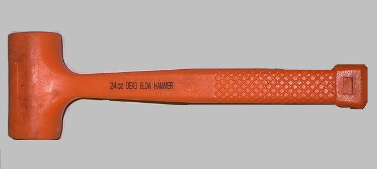
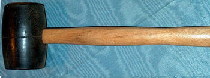

.. _hammers:

Hammers
=======
Hammers, sometimes casually called persuaders, are used to drive pieces
together. Their form ranges from tiny hammers wielded by micro-scale hobbyists
to hydraulic devices lifted over building pillars by cranes and operated by
entire crews of people. For our discussion, we are going to talk about a few
of the most common types of hammers you can expect to encounter.

Types of Hammers
----------------

.. raw:: html

    

    <iframe width="560" height="315" src="https://www.youtube.com/embed/aMl9gIhRQno" frameborder="0" allowfullscreen>
    </iframe>
    

.. figure:: ./images/claw_hammer.jpg
 :align: right
 :scale: 30 %

 `Claw Hammer (Wikipedia) <https://commons.wikimedia.org/wiki/File:Claw-hammer.jpg>`_

* **Claw Hammer** - Commonly referred to as the carpenter's hammer, the claw
  hammer is generally used for nailing and pulling nails. The claw hammer is
  made of very hard steel and should never be struck against another hammer or
  metal object as the head may fracture and produce metal chips. The tapered
  slot or "claw" on the back of the hammer head is used to pry nails out using
  the extra leverage of the handle. An oversized version of the claw hammer
  is the framing hammer, commonly with a checkered hammer face to help keep
  each blow on the nail head.

.. figure:: ./images/ball_peen_hammer.jpg
  :align: right
  :scale: 70 %

  `Ball-Peen Hammer (Wikipedia) <https://commons.wikimedia.org/wiki/File:Ball-peen_hammer_380mm.JPG>`_

* **Ball-Peen Hammer** - There are many variations of the peening hammer
  (straight-peen, cross-peen, diagonal-peen), but the ball-peen or machinist's
  hammer is the most common. This hammer has a flat face used to strike chisels,
  punches, and other metal tooling and a hemispherical peening face used to
  work metal and round rivet heads. This is one of the most commonly used
  hammers when marking metal, prototyping, and working in the laboratory.

* **Brass Hammer** - Brass hammers are used in situations where sparks
  generated when striking an object could pose an explosion hazard. Such
  situations often arise when working with petroleum, natural gas, or other
  flammable materials. Brass hammers can also be used on objects that must not
  be damaged assuming that the brass is the softer material (though mallets
  are often used for this task as well).

 `Dead Blow Hammer (Wikipedia) <https://commons.wikimedia.org/wiki/File:Dead_blow_hammer.jpg>`_

* **Dead Blow Hammer** - When working on precision work, the rebound of a hammer
  is often undesirable as the bounce could result in marring or damage of the
  part. On such delicate work, the very short duration over which the hammer's
  kinetic energy is delivered is also a problem. The dead blow hammer is
  generally hollow and filled with sand or metal shot (small metal balls). The
  shot lengthens the time of energy delivery and reduces rebound.

 `Claw Hammer (Wikipedia) <https://commons.wikimedia.org/wiki/File:Claw-hammer.jpg>`_

* **Mallet** - The mallet is a large faced hammer that is smaller than a sledge
  and is generally made from rubber, rawhide, or wood. Mallets deliver smaller
  amounts of energy with a soft and non-damaging face. They are generally used
  for small adjustments or in the assembly of delicate electromechanical
  devices such as motors.

Use
---
Using a hammer just takes practice and careful selection. Choosing the correct
style and weight of the hammer can make a large difference to how successful
your operation is. Raise the hammer and strike the object with the head of the
hammer square to the surface being hit.

.. raw:: html

    

    <iframe width="560" height="315" src="https://www.youtube.com/embed/g6dvj4MKjDc" frameborder="0" allowfullscreen>
    </iframe>
    

Safety Precautions
------------------
The largest safety hazard is crushing on fingers or toes. Being careful and
practicing aiming the hammer blows will help reduce this risk, but even
experienced carpenters and machinists will sometimes miss their mark. Using
paper fixtures to hold nails safely away from your fingers when learning may
be helpful. There is always the chance of the hammer head or tool being struck
fracturing. If this occurs, flying metal fragments could result, so eye
protection is essential.
