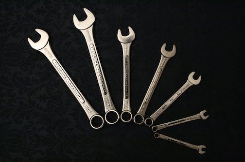

.. _hand_tools:

Hand Tools
==========

`Combination Wrench Set (Wikipedia) <https://commons.wikimedia.org/wiki/File:2008-04-14_Chrome-Vanadium_Wrenches.jpg>`_

Hand tools are some of the most commonly used tools. Knowing the names of basic
tools and how to use them will greatly speed up your work while also making it
safer. A basic set of hand tools can be collected for a few hundred dollars and
if cared for properly can provide a lifetime of service.

Contents:

.. toctree::
   :maxdepth: 1

   screwdrivers
   files
   hammers
   pliers
   saws
   squares
   wrenches
