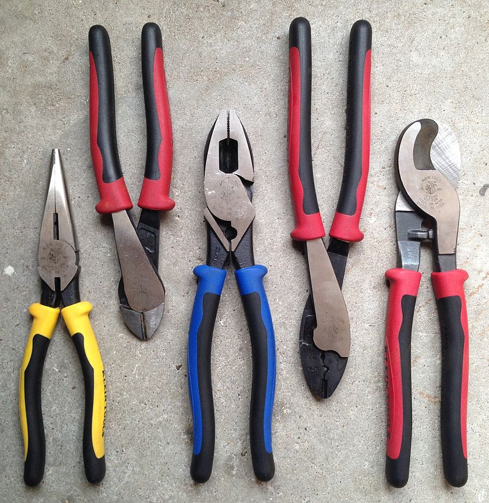
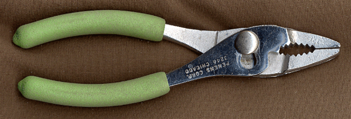
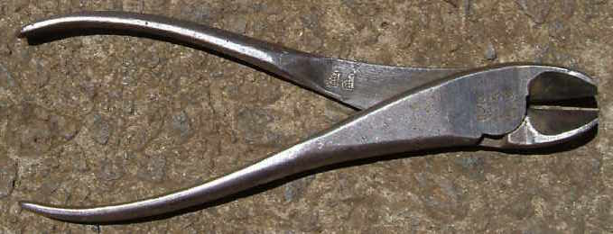
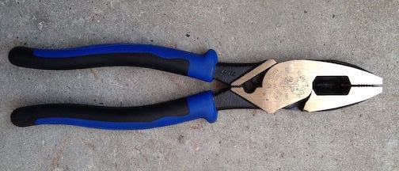
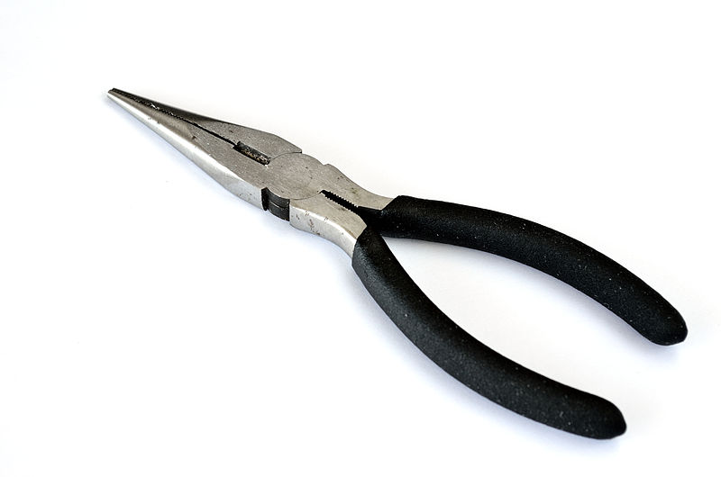
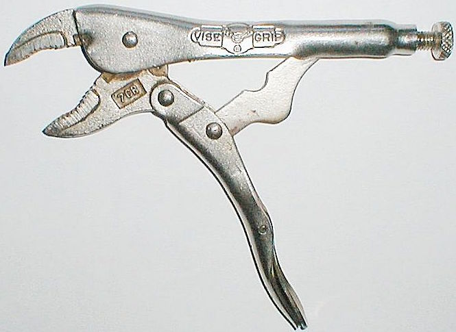
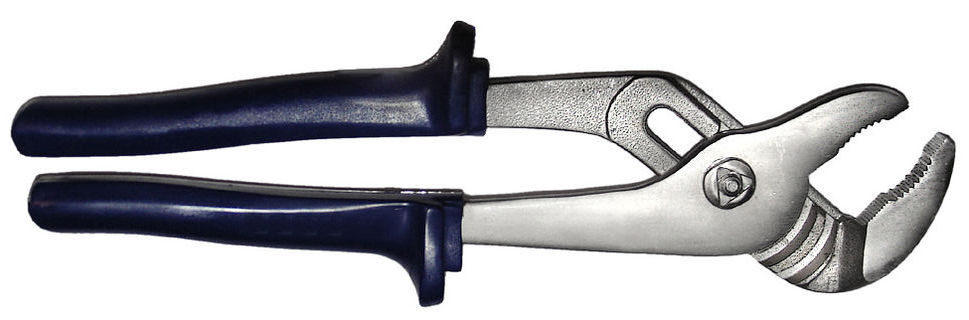
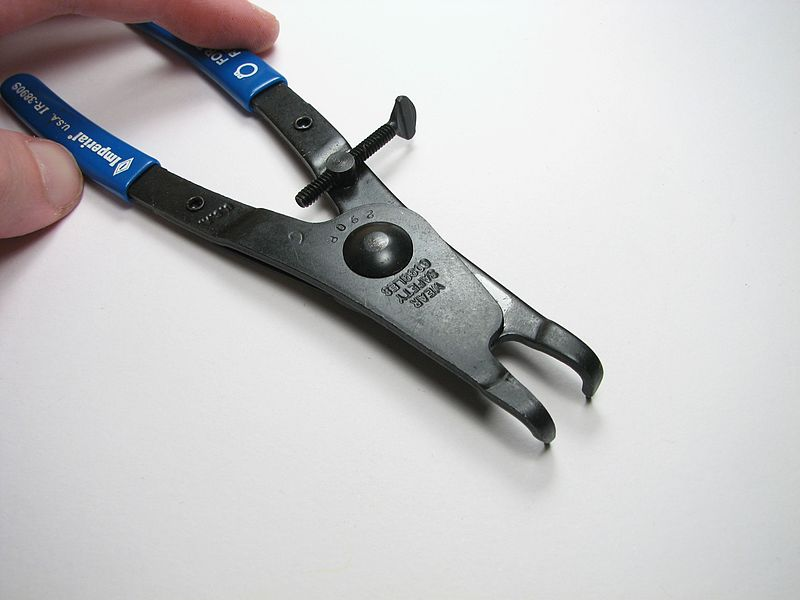

.. _pliers:

 `Image: Wikipedia <https://commons.wikimedia.org/wiki/File:Klein_Journeyman_pliers.jpg>`_

Pliers
======
Pliers are used to bend, grab, compress, twist, and otherwise manipulate
objects by amplifying your grip force with crossed levers. There are a blinding
variety of pliers on the market in every imaginable shape and size. There are
narrow pliers, tiny pliers, long pliers, curved pliers, and a thousand other
speciality types. Here we will cover the basic types of pliers from which the
others are derived. Again, there is little standardization on the size of each
type of plier.

Types of Pliers
---------------------

 `Slip Joint Pliers (Wikipedia) <https://commons.wikimedia.org/wiki/File:Pliers_slip_01CJC.png>`_

* **Slip Joint Pliers** - The slip-joint plier is possibly the most commonly
  used in the toolbox. It is a general purpose plier whose center joint can
  be offset to allow the user to grip a thicker object while still having the
  handles be spread a reasonable distance. Pliers that look identical, but have
  no adjustable jaw spacing are called combination pliers, but slip joint pliers
  are slightly more versatile.

 `Diagonal Cutters (Wikipedia) <https://commons.wikimedia.org/wiki/File:Side_cutters.jpg>`_

* **Diagonal Cutters** - These pliers are designed to cut wire and other small
  gauge material. They do not shear the material like scissors, but instead
  their "V" shaped cutting surfaces indent and wedge the material apart. They
  are most commonly used to cut mechanic's wire (security wire) and other small
  materials in the shop.

 `Lineman's Pliers (Wikipedia) <https://commons.wikimedia.org/wiki/File:Klein_lineman%27s_pliers.jpg>`_

* **Lineman's Pliers** - Designed primarily for electricians, these pliers are
  used to cut, twist, and crimp wire. They have a large and heavy serrated
  gripping section at the nose of the plier, and cutting section in the craw
  (near the pivot), and an optional crimping area. These are used generally
  when mains wall power wiring is necessary. They are often certified to protect
  the user from a given voltage on a live wire.

 `Needle-Nose Pliers (Wikipedia) <https://commons.wikimedia.org/wiki/File:Long-nosePliers.jpg>`_

* **Needle-Nose Pliers** - The long and narrow nose of these pliers makes them
  ideal for reaching back into tight spaces to grab or twist wires, tubes, and
  other small items. Needle-nose provide excellent control and are used during
  electrical work and for small scale assembly. Many models have a cutter
  integrated into the craw of the plier. Many sizes of needle nose are made
  and keeping as many different sizes as possible in your tool box is a good
  idea.

 `Locking Pliers (Wikipedia) <https://commons.wikimedia.org/wiki/File:Locking_pliers.jpg>`_

* **Locking "Vice-Grip" Pliers** - Locking pliers are used for jobs that need
  continued application of a very strong gripping force. These pliers have a
  clamping point that is adjusted by a thumbscrew. When gripped, if the
  break-over point is passed, the pliers will lock and maintain a strong grip.
  The grip is released by squeezing a small handle under the grip. The
  unlocking action can be sudden and violet, so use care to avoid injury when
  removing locking pliers.

.. raw:: html

    

    <iframe width="420" height="315" src="https://www.youtube.com/embed/PyUA2YRHYSs" frameborder="0" allowfullscreen>
    </iframe>
    

 `Slip-Joint Pliers (Wikipedia) <https://commons.wikimedia.org/wiki/File:Multiple_pliers.jpg>`_

* **Tongue-and-groove "Channellock" pliers** - These pliers, sometimes referred
  to as "slip-joint" have offset jaws that can be set apart at several offsets.
  Similar to the combination/slip-joint plier, this means large objects can
  be easily gripped with small handle spreads. These pliers are often used when
  holding large nuts, bolts, or pipes.

 `Ring Pliers (Wikipedia) <https://commons.wikimedia.org/wiki/File:Retaining_ring_pliers.jpg>`_

* **Ring Pliers** - Ring or "circlip" pliers have jaws that bend at a right
  angle to the plane of the handles and have two small circular pegs. These
  are used to compress and spread the diameter of retaining clips to install
  them into retaining grooves. There are different sizes for different sizes
  and styles of retaining clips. Do not use them for anything other than
  installing the clips as it will damage the pegs and make the tool useless.

Use
---
Pliers and squeezed to grip and cut or bend their target object. Locking pliers
have some locking features that operate in various ways depending on the
manufacturer.

Safety Precautions
------------------
Pliers pose a large pinching hazard that can result in cuts and sub-dermal
bleeding/blood-blisters. The most common injury is pinching a finger or finger
webbing near the plier pivot when pliers slip off of their target object. When
appropriate gloves can been worn. Eye protection should be worn, especially if
any cutting operations will be taking place.
