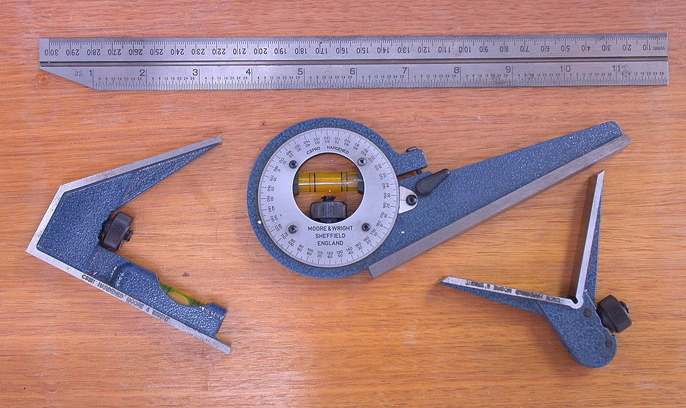
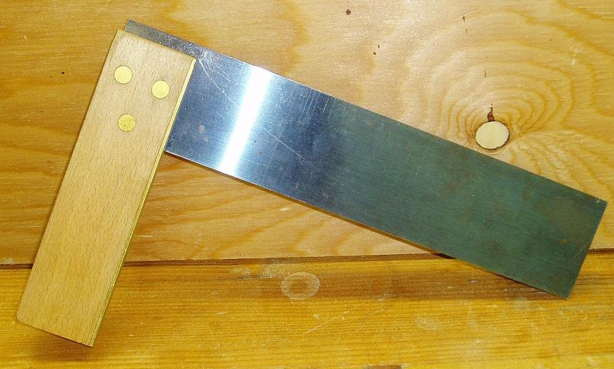
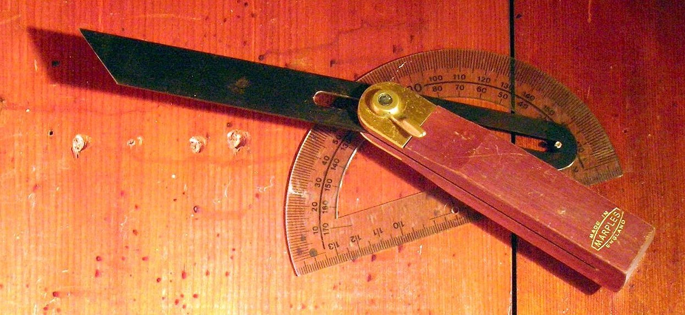
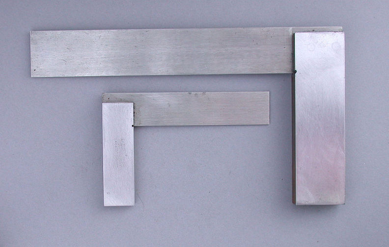
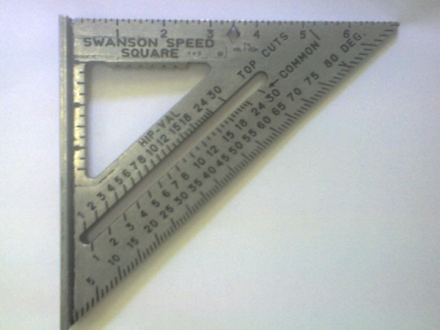

.. _squares:

Squares
=======

Squares are used to alight objects, mark straight lines, and check for proper
fit or assembly of machines.

Types of Squares
----------------

 `Combination Square (Wikipedia) <https://upload.wikimedia.org/wikipedia/commons/a/a8/CombinationSquareSet.jpg>`_

* **Combination Square** - The combination square consists of a grooved ruler
  that accepts multiple different heads for different functionality. The most
  commonly used head has a 90 and 45 degree angle, along with a scribe and
  level used to check level/plumb of the part. There are also variable angle
  and "V" attachments used to measure arbitrary angles and the center of round
  dowels respectively.

|

 `Try Square (Wikipedia) <https://commons.wikimedia.org/wiki/File:Trysquare.jpg>`_

* **Try Square** - Named because it is often used to "try" a surface for
  squareness, the try square is most commonly used to test and mark wood
  pieces. It is commonly made of a wooden stock with riveted metal blade. The
  try square is very similar is use to the machinist's square.

|

* **Sliding T-Bevel Square** - This square is often referred to as a "false
  square" as it is an adjustable blade square. The blade can be set to the
  desired angle using a protractor, or more commonly the T-bevel is used to
  transfer an angle by setting it on the original piece and then marking
  another piece.

 `T-Bevel Square (Wikipedia) <https://commons.wikimedia.org/wiki/File:T_bevel.JPG>`_

 `Machinist's Square (Wikipedia) <https://commons.wikimedia.org/wiki/File:SquareEngineersMachinist.jpg>`_

* **Machinist's Square** - The machinist's square is the metalworking version
  of the try square. They are manufactured to very high precision, generally in
  A and B grades with deviations of much less than a thousandth of an inch per
  inch of run. These squares are made of metal that is pinned and should be
  checked for accuracy periodically. The most common use of the machinists
  square is workpiece marking and tool alignment.

|

 `Speed Square (Wikipedia) <https://commons.wikimedia.org/wiki/File:Swanson_Speed_Square_by_NIP.JPG>`_

* **Speed Square** - Invented in 1925, this is a very versatile square and one
  that is often reached for when making 90 or 45 degree marks. The square
  includes carpentry features to easily measure roof pitch and other common
  tasks. The speed square is available in 7" and 12" models made of metal or
  plastic. The Swanson tool co. (the original designers and manufacturers) offer
  a small book to accompany the squares describing their various uses.

Use
---
.. raw:: html

    

    <iframe width="560" height="315" src="https://www.youtube.com/embed/WWj_4sxL79g" frameborder="0" allowfullscreen>
    </iframe>
    

Squares are adjusted to the desired angle (if applicable) and aligned with the
workpiece. They are then used as a guide, marking tool, or visual inspection
tool. The video above demonstrates many of the common uses of squares in the
shop. Squares that are dropped or experience extreme temperatures should always
be checked before use as they could have been damaged.

Safety Precautions
------------------
Some squares may have sharp edges, wearing gloves is recommended with such
squares. If the square is going to be used as a cutting guide, it must be
firmly clamped, otherwise it could become a projectile.
