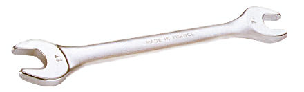

.. _wrenches:

Wrenches
========

Wrenches are used to amplify force through use of a lever to tighten of loosen
nuts, bolts, pipes, and other threaded objects. There are many types
(`list <https://en.wikipedia.org/wiki/Wrench>`_), but here we will cover the
non-speciality wrenches commonly used in prototyping, apparatus construction,
and apparatus maintenance.

Types of Wrenches
-----------------

 `Open End Wrench (Wikipedia) <https://commons.wikimedia.org/wiki/File%3ACl%C3%A9_plate.jpg>`_

* **Open End Wrench** - Open end wrenches fit around the faces of a nut or bolt
  head and are specified in the size of the opening in the jaw. You may also
  hear these called "open ended spanners". They are easy to rapidly apply and
  remove, but can slip off and caused rounded bolt corners and skinned knuckles.
  You must use an open end wrench when the top and bottom of the fittings are
  inaccessible, such as tube fittings.

 .. figure:: ./images/box_end_wrench.jpg
  :align: right
  :width: 200 px

  `Box End Wrench (Wikipedia) <https://commons.wikimedia.org/wiki/File:Kluc_ockovy_vysunuty.jpg>`_

* **Box End Wrench** - These wrenches are completely closed, making them very
  secure on the nut/bolt being turned, but they can only be used when the
  top of the fitting can be accessed. When possible, use a box end wrench
  instead of the open ended. Box ended wrenches are commonly offset making
  their use easier in many situations.

 .. figure:: ./images/combination_wrench.jpg
  :align: right
  :width: 200 px

  `Combination Wrench (Wikipedia) <https://commons.wikimedia.org/wiki/File:Kluc_ockoplochy.jpg>`_

* **Combination Wrench** - The combination wrench has both an open and box ended
  wrench of the same size on the same tool. This is the most common wrench in
  the toolbox and the most versatile. When equipping your shop, these should
  be one of the first purchases in both imperial and metric sizes.

.. figure:: ./images/flare_nut_wrench.jpg
 :align: right
 :width: 200 px

 `Flare Nut Wrench (Wikipedia) <https://commons.wikimedia.org/wiki/File:Bremsleitungsschluessel.JPG>`_

* **Flare Nut Wrench** - The flare nut wrench solves the problem of tubing
  fitting accessibility faced by the box end wrench, while providing many of
  the same advantages. There is a slot in the end, allowing the wrench to pass
  over the tube, but still encircle the fitting to provide a positive purchase.
  The wrench is commonly much thicker than standard wrenches to distribute the
  tightening force over a larger surface area to reduce the risk of damage to
  pipe fittings, which are commonly make of soft metals.

 .. figure:: ./images/adjustable_wrench.jpg
  :align: right
  :width: 200 px

  `Adjustable Wrench (Wikipedia) <https://commons.wikimedia.org/wiki/File:AdjustableWrenchWhiteBackground.jpg>`_

* **Adjustable Wrench** - Often called the "Crescent wrench" after the brand
  name, this wrench is single handedly responsible for the destruction of more
  fasteners than any other tool in history. These wrenches have jaws offset
  from the handle about 15 degrees to help them work in close quarters. The
  jaw size can be adjusted with a worm gear drive to fit any nut size equally
  poorly. Tightening fasteners with adjustable wrenches requires careful
  adjustment to avoid the wrench slipping off the fastener, rounding the
  corners of the fastener, and making it difficult to tighten or remove. Only
  use adjustable wrenches when an appropriate fixed sized wrench is unavailable.

 .. figure:: ./images/ratchet_wrench.jpg
  :align: right
  :width: 200 px

  `Ratchet Wrench (Wikipedia) <https://commons.wikimedia.org/wiki/File:Socket_wrench_and_sockets.JPG>`_

* **Ratchet/Socket Wrench** - Ratchet wrenches have a one-way mechanism,
  allowing rapid tightening/loosening of fittings with a near full range of
  motion. They are available in multiple "drive sizes" that describe the size
  of the square shaft used to transfer torque from the wrench to the tooling.
  Generally sockets are used on the end to tighten or loosen nuts/bolts. At
  high torques the ratchet mechanism can fail, but these are generally the
  quickest way to work on assemblies with access to the tops of the fasteners.

* **Socket Accessories** - There are a number of accessories for socket
  wrenches. Typical accessories that should be in the lab box are extensions
  that allow deep reach into cavities with the sockets, universal joints that
  allow the wrench and socket to operate at an angle to each other, and
  crow-foot tools that allow access to nuts/blots with limited clearance and
  no top access.

 .. figure:: ./images/breaker_bar.jpg
  :align: right
  :width: 200 px

  `Breaker Bar (Wikipedia) <https://commons.wikimedia.org/wiki/File:Breaker_bar.jpg>`_

* **Breaker Bar** - This solid bar fits sockets of a fixed drive size and allows
  very tight torques to be applied without fear of stripping the ratcheting
  mechanism. These bars are often very large in diameter and long to provide
  extra mechanical advantage. When even more leverage is needed, users often
  slip an extra length of pipe over the handle to further extend it (a
  "cheater bar"). This practice is dangerous as it could case the drive to shear
  and all of the parts of the assembly to fall, possibly crushing hands or toes.
  The rapid release of energy can also cause head trauma if the user is in-line
  with the handle.

 .. figure:: ./images/torque_wrench.jpg
  :align: right
  :width: 200 px

  `Torque Wrench (Wikipedia) <https://commons.wikimedia.org/wiki/File:Dinamometrica_digital.jpg>`_

* **Torque Wrench** - This ratcheting handle has a mechanism to measure torque
  exerted. Generally these wrenches have a set-point after which the wrench
  will break-over indicating that the desired torque has been reached. Torquing
  fasteners to the proper specification is important for many precision
  assemblies. Wrenches that range from inch-pounds to hundreds of foot-pounds
  are commonly found in lab tool boxes.

 .. figure:: ./images/pipe_wrench.jpg
  :align: right
  :width: 200 px

  `Pipe Wrench (Wikipedia) <https://commons.wikimedia.org/wiki/File:Trimo_pattern_Aluminum_Pipe_Wrenches.jpg>`_

* **Pipe Wrench** - These adjustable jaw wrenches strongly grip circular tubes
  when pulled towards the jaw opening, and release when pulled in the other
  direction. This makes it easy to rapidly tighten pipes. The teeth of the
  wrench generally mar the finish, but this is not considered as important
  as a tight connection for plumbing applications. Pipe wrenches are another
  often abused tool, used to tighten large nuts when the correct tooling is
  not available. Again, this is not recommended.

.. raw:: html

    

    <iframe width="560" height="315" src="https://www.youtube.com/embed/3-rlyegejYY" frameborder="0" allowfullscreen>
    </iframe>
    

Use
---
Wrenches follow the same principle of "righty tighty, lefty loosey" as
screwdrivers for right-handed threads. Socket wrenches have a lever to reverse
their direction of operation.

Safety Precautions
------------------
Pinching and crushing hazards are the largest safety issues when using wrenches.
If the tool slips off of the fastener, it is easy to skin, pinch, or crush your
hands. Gloves may be worn during operation, but an engaged and attentive user
is the best safety precaution. **NEVER** use a wrench for anything but its
intended purpose, doing so will likely result in damage to the tool and you.
As mentioned above, extension bars are also not a good idea as they often
over stress the tool.
