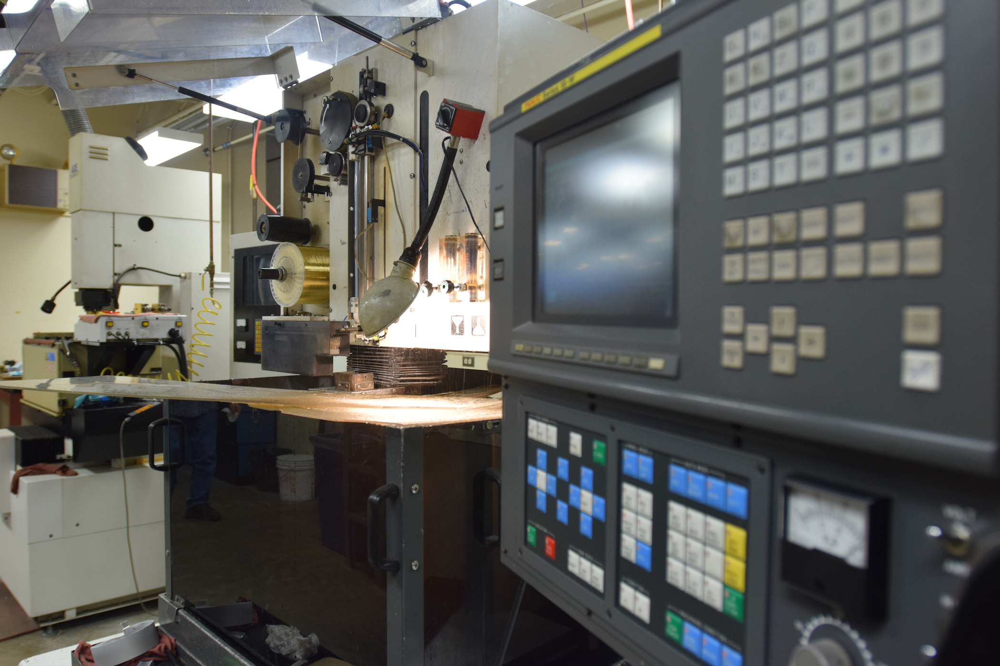

.. _edm:

Electrical Discharge Machining (EDM)
====================================

   Photo of an EDM (Ellis Dunklebarger)

One of the most precise and expensive machining techniques available is the
electrical discharge machining (EDM) technique. A conductive part is mounted to
a computer controlled table and submerged in a dielectric fluid (commonly oil or
de-ionized water). An electrode is then brought very close to the part and a
pulsed electrical power applied. The voltage between the electrode and part
reaches the breakdown point of the dielectric and a spark occurs. This spark
removes material from the workpiece and the electrode. After the spark is
complete, fluid rushes in to sweep away waste material and cool the part. The
workpiece is slowly eroded away until it is the desired shape. Electrodes are a
significant cost of operating the machine. Systems that use a wire electrode
pass it through the cutting area only once, then it is discarded.

.. figure:: ./images/edm_closeup.jpg
   :align: center
   :scale: 50 %

   Wire EDM (Ellis Dunklebarger)

The "kerf" of this process is very consistent around 0.001 in (0.03 mm).
Therefore, machining accuracy of about 0.001 in (0.03 mm) is common, with an
order of magnitude improvement possible for very high tolerance parts. The EDM
surface finish is also very good.

Safety Precautions
------------------
The main safety hazard with EDM is shock and slip. Avoid contact with the
dielectric fluid or part when the machine is in operation. If the dielectric is
spilled or is on your hands, make sure it is promptly cleaned as it is a slip
and dropping hazard. Talk to your machine shop supervisor to learn any safety
precautions specific to your machine and shop.

.. raw:: html

    

    <iframe width="560" height="315" src="https://www.youtube.com/embed/eaeEn1Gs4aQ" frameborder="0" allowfullscreen>
    </iframe>
    </iframe>
    

It is also possible to build a basic EDM machine for use in the home or lab
shop.

.. raw:: html

    

    <iframe width="560" height="315" src="https://www.youtube.com/embed/-a1JEWbnvMo" frameborder="0" allowfullscreen>
    </iframe>
    

