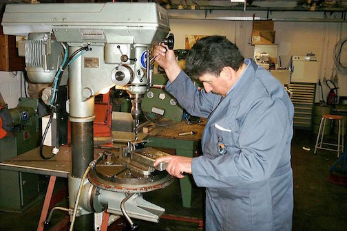

.. _drill_press:

Drill Press
===========

 `Drill Press (Wikipedia) <https://commons.wikimedia.org/wiki/File:Drillpress.jpg>`_

The drill press (pedestal drill) is a fixed drilling machine that is found in
almost every shop. They are available in everything from bench-top sizes to
floor-standing machines much taller than their operators. Drill presses are
commonly sold based on their "swing", which is twice the distance from the
drilling head to the support column (the machine's "throat"). The table of the
drill press allows the operator to effectively clamp the work down and drill
holes in a fixed orientation with much better positioning than possible with a
hand drill. The levers used for plunging the tool into the work also provide
some mechanical advantage to help increase the down-pressure on the bit.

Most common drill presses are driven by a set of pulleys and belts in the top
housing of the machine. These offer many different speeds for drilling holes of
different sizes in different materials. There are machines with geared heads
available that will not slip as belts sometimes do. They are most commonly found
in heavy industrial settings where metal is being drilled and high-torque,
low-speed operation is the key. Machines called radial arm dill presses have a
head that can swing around the column, providing a very large working area and
reducing the amount of re-clamping necessary to drill holes over large parts.

Use
---
Many videos focus on working with wood, but similar principles apply to
metalwork as well. The video below is a good two-minute introduction to the
drill press.

.. raw:: html

    

    <iframe width="560" height="315" src="https://www.youtube.com/embed/NU6EyTxfl_A" frameborder="0" allowfullscreen>
    </iframe>
    

Safety Precautions
------------------
The main safety hazard with the drill press is the workpiece becoming caught in
the drill and spinning. The best way to combat this is good clamping and careful
selection of the drill bit and speed to match the material being drilled.
