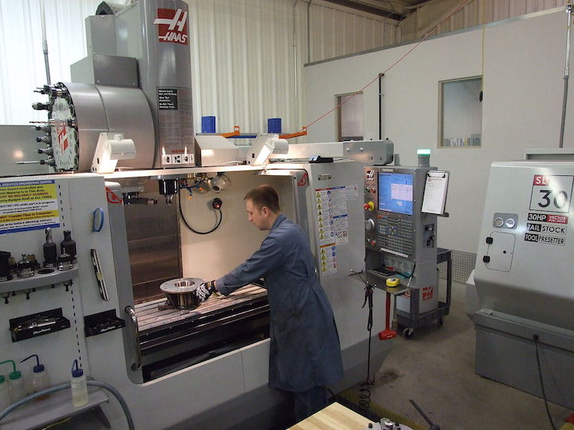

.. _machine_tools:

Machine Tools
=============

`CNC Workstation (Wikipedia) <https://commons.wikimedia.org/wiki/File:NREC_Machine_Shop_Workstation.jpg>`_

Machine tools are a special category of power tools used to make precision parts
and equipment. The main tools of the mill, lathe, and drill-press will be
introduced, along with a few other useful, but less common tools. Learning to
use these tools requires practice in the shop with an experienced supervisor to
ensure your safety. Here we will introduce the machines, discuss basic use, and
some safety precautions that should be observed when machining.

Contents:

.. toctree::
   :maxdepth: 1

   drill_press
   grinder
   EDM
   lathe
   mill
   plasma_cutter
   water_jet
