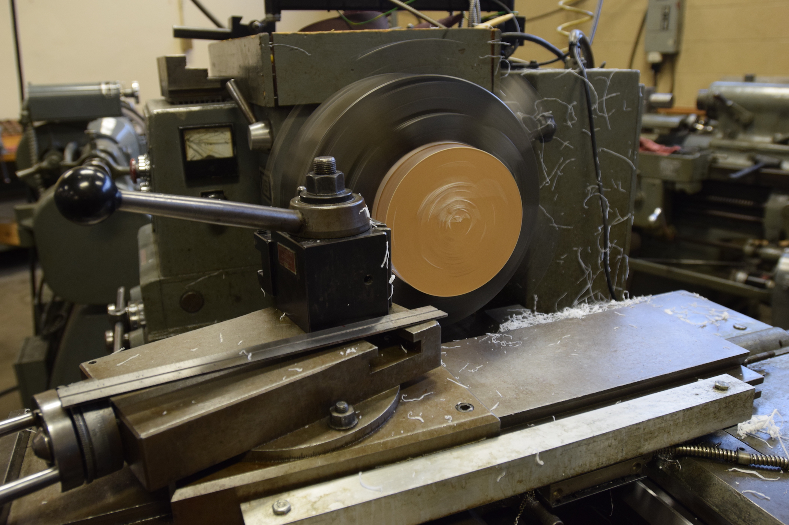
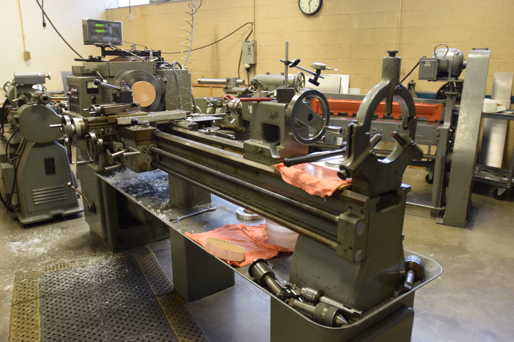

.. _lathe:

Lathe
=====

   Turning Acrylic (Ellis Dunklebarger)

The lathe is one of the most commonly used tools in the machine shop. It rotates
the workpiece that is gripped in a chuck. The headstock that drives the chuck
may be belt or gear driven, but is adjustable in speed to generate the correct
surface speed for a given part size and operation. The material is cut by tools
held stationary on a carriage that travels up and down the lathe bed. The lathe
is the only machine tool that can completely build itself.

   Tool Room Lathe (Ellis Dunklebarger)

Lathes are commonly used to turn down parts, bore holes, cut threads or grooves,
facing parts, and cutting off parts. Learning each of these operations is
relatively simple. The videos below provides a good overview of lathe operation.

.. raw:: html

    

    <iframe width="420" height="315" src="https://www.youtube.com/embed/Za0t2Rfjewg" frameborder="0" allowfullscreen>
    </iframe>
    

.. raw:: html

    

    <iframe width="420" height="315" src="https://www.youtube.com/embed/jXET1-g6CJA" frameborder="0" allowfullscreen>
    </iframe>
    

.. raw:: html

    

    <iframe width="420" height="315" src="https://www.youtube.com/embed/3ue8XtStUBA" frameborder="0" allowfullscreen>
    </iframe>
    

Safety Precautions
------------------
The biggest safety hazard is becoming entangled in a rotating part and having
body parts sheared off by the machine. Hair, clothing, and anything else hanging
from the body present hazards. Also, never try to clean a rotating part
(especially threads) with a cloth as it will become entangled and pull your
finger/hand in. The other main hazard is a workpiece coming unclamped and flying
out of the machine. Proper eye protection should also be worn.
