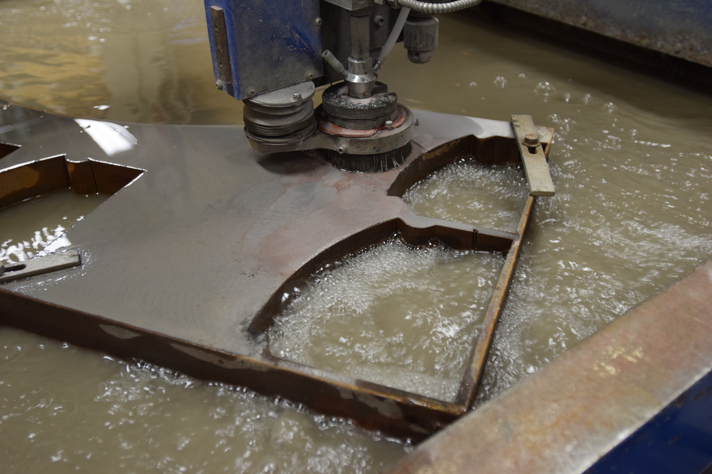
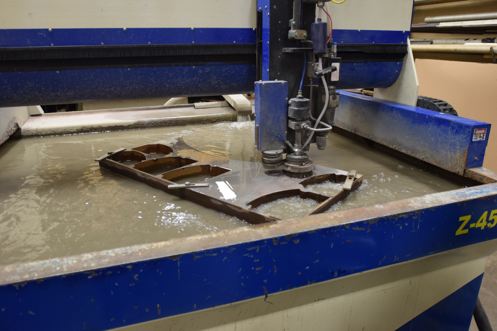

.. _water_jet:

Water Jet
=========

   Waterjet cutting a thick steel plate (Ellis Dunklebarger)

The water jet cutter, if you have access to one, is an incredibly useful and
precise tool. It propels Garnet particles with a very high pressure jet of water
to abrade through the workpiece. Multi-axis machines can even cut very complex
3D shapes. Water jet cutters make very clean cuts that are easily good to
a 0.001" (0.03 mm) tolerance. These machines are exceedingly expensive to own
and operate, so it is common to outsource water jet projects.

   A waterjet cutter in operation (Ellis Dunklebarger)

Use
---

Each machine operates slightly differently, but the basics of water jet
operation are outlined by Dan Gelbart in the video below:

.. raw:: html

    

    <iframe width="560" height="315" src="https://www.youtube.com/embed/m46YxAurhpM" frameborder="0" allowfullscreen>
    </iframe>
    

Some examples of using a water jet to create 2D and 3D parts:

.. raw:: html

    

    <iframe width="560" height="315" src="https://www.youtube.com/embed/FqjEFAtEZKE" frameborder="0" allowfullscreen>
    </iframe>
    

Safety Precautions
------------------
The main hazard from a water jet cutter is instantly cutting off fingers if the
jet is turned on while your fingers are near the nozzle. Water jets can easily
cut through several inch thick steel plates, so humans pose no challenge.
