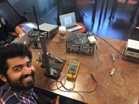

.. _Bolton_Chas_2016:

Automatic DCDT Calibration Device - Chas Bolton
=============================================

|image0|\ **Project goals**

My semester project was aimed at improving our calibration techniques
for the DCDTs. Currently, the technique for calibrating the DCDTs is
done manually and is quite time consuming. In particular, to calibrate a
DCDT one must mount the core to a vertical measuring device and clamp
the outer part of the DCDT to a stationary ring stand. The user then
moves the core in increments of 1mm or less throughout its entire
voltage range. After one 1mm of displacement, the user must measure and
record the voltage at this position. Again, this process will continue
for the entire voltage range of the DCDT.

My goal was to improve the efficiency of this technique by creating a
device that would automatically move the DCDT throughout its voltage
range. Therefore, after the device is setup properly the only task for
the user would be to simply record the voltage measurements. To carry
out this task, I designed a holding bracket that would hold the DCDT and
the bracket itself moves via a stepper motor that is controlled from a
stepper motor driver and Arduino.

**Design**

The first major design task was deciding how to hold and move the DCDT.
To solve the issue of holding the DCDT, I came up with the idea of
creating a holding bracket via 3D printing that would consist of a flat
plate with a cylindrical holder mounted in the center of the plate that
the DCDT could fit into.

To move the DCDT move up and down, I decided to mount the bracket
assembly to two aluminum rods and allow the bracket to slide up and down
the rods by a stepper motor, belt and pulley. To mount the rods to the
DCDT bracket, I decided to use a set of linear ball bearings which would
screw on to the bracket and would allow the bracket to move smoothly up
and down the rods. The aluminum rods themselves would be mounted to a
plywood frame.

The next step was deciding how to attach the belt to the bracket and how
to mount the pulleys. I decided that the pulley could easily be mounted
at the top of my frame via a U-bolt. However, once I started the
assembly process I slightly modify this part. To mount the belt to the
bracket, I decided to screw two I-bolts through the bracket and parallel
with the cylindrical holder on the bracket. By using I-bolts, I could
loop the belt through the I-bolts and tie them back into each other.

The final design task was deciding what material to build the frame
with. I decided on using plywood, as this would be easy to work with and
to mount things on. When deciding on the dimensions of the frame, I was
primarily concerned with the height dimension due to the fact that the
frame needed to be high enough to calibrate the DCDTs with long cores. A
frame height of 2 feet was sufficient enough to accommodate this
criterion.

Once I had an idea of how the project was going to work and what was
needed to complete the project, I compiled a list of parts. The parts
needed to complete my project consisted of stepper motor, a driver to
control/drive the stepper motor, two aluminum rods, two linear ball
bearings that the DCDT holder could mount to and slide up and down the
rods, a belt, two pulleys, U-bolt, 2 I-bolts, and plywood.

|image1|

**Assembly**

The DCDT bracket was the first part that I sought out to design. At
first, I considered having the machine shop design the bracket out of
steel. However, I soon realized that this would be too expensive and
unnecessary for simply moving a DCDT up and down. Therefore, I decided I
would make my DCDT holding bracket via 3D printing. Before creating the
bracket in On-Shape, I hand sketched all the components of the bracket
along with their exact dimensions. Once this was completed I created the
bracket in On-Shape and 3D printed the assembly.

|image2| The next object I built was the frame. To do this, I used a
jigsaw to cut the correct dimensions of

the plywood and then assembled a simple frame consisting of two base
plates and two side panels. The top and bottom pieces of plywood are
used for mounting the stepper motor, pulley and aluminum rods. I mounted
the aluminum rods in the center of the frame roughly 11 centimeters
apart by drilling two holes through the top piece of plywood and two
holes in the bottom piece of the plywood. The top holes are drilled all
the way through the plywood for the aluminum rods to slide through,
while the bottom holes are drilled only half way into the plywood so
that the aluminum rods can be held securely in place.

The next task was to power my stepper motor and driver. I first mounted
my driver with a set of headers to the breadboard of the Arduino and
powered it up through an external power supply. |image3|\ However, after
doing this the voltages coming out the driver was inconsistent so I
decided to solder the headers onto the driver. After soldering the
headers on to the driver, the voltage readings come out of the driver
were much more consistent. Once the driver seemed to be working
properly, I modified an Arduino code such that I could move my motor in
precise increments of 1mm and stop for 5 seconds and then move another 1
mm. After a total of 30 mm, the motor would then switch directions and
move under the same conditions. To calculate the number of steps the
motor must undergo for 1 mm of displacement, I used the following
formula. Total number of steps per revolution/ total number of teeth on
pulley times the pitch. Thus, for my assembly this equates to (400\*
8)/2. The factor of 8 is due to the 1/8 micro stepping feature of the
driver.

Once the motor was running properly and frame was built, I began working
on connecting everything together to see if the project was actually
going to work. I mounted my upper pulley to the top piece of plywood via
a screw and two metal holding brackets. After the

belt and pulleys were properly assembled, I was able to run the first
test to see if the project was actually going to work.

The first few trial tests turned out to be unsuccessful with making the
bracket move. I began looking for issues with the design and noticed
that the major problem was associated with the belt slipping on the
pulley. My initial thought was that I was not supplying the motor with
enough power. Therefore, I altered the power supply voltage and
regulated the voltage coming from the potentiometer on the driver
several times, but all to no avail. After assuming that it was not an
electrical issue, I assumed that my problem could be a mechanical issue.
Furthermore, I noticed that my belt was very loose and this might be the
main source of error. After tightening the belt, the bracket began to
move! However, it was still slipping and only moving in very small
increments. Once I found this out I knew my problem was purely a
mechanical issue. After thoroughly looking over everything on my frame,
I noticed two other problems in addition to the loose belt. There was a
slight misalignment between the two linear ball bearings that were
mounted on the DCDT bracket and the top pulley mounted on the frame was
not rotating smoothly and freely. Once I fixed these issues, the system
started moving smoothly and the bracket was able to move up and down the
aluminum rods in a continuous motion.

Currently, the automatic DCDT calibration device is able to move in
smooth increments of 1mm, stop for 5 seconds and move another 1 mm. This
process continues for 30 mm and the motor then switch directions. The
idea of moving 1 mm is to ensure the voltage readings of the DCDT is
linear with respect to displacement. The 5 second wait time is included
to allow the user enough time to record the voltage measurements at a
particular position. And the 30 mm, is around the average range of a
typical DCDT. The idea of switching the motors direction is implemented
make sure there is no hysteresis effect associated with the DCDT. All of
these parameters can be changed by the user, and for a particular DCDT.
For instance, not all DCDTs will need the full 30 mm range and this
number can be increased or decreased. In addition, the user may need to
increase the time it takes to read and record a voltage measurement and
this can be done by simply changing the code to pause for 10 seconds.

**Problems/Future work**

The main problems that I encountered while working on this project were
associated with the assembly process as mentioned above. If I were to
continue working on this project to further its improvement there are a
few modifications, I would make. First, I would redesign the upper
pulley and belt system. As of right now, the belt has too much slack. I
think the system would move much more smoothly if the belt was tighter.
This could be done by implementing a spring the pulley/belt assembly.
Also, I would consider reducing the size of the top and bottom portions
of the frame and perhaps reducing the height of the side panels. As of
right now, the frame is burdensome to move around and to work with.

.. |image1| image:: images/image2.jpg
   :width: 2.67153in
   :height: 2.30972in
.. |image2| image:: images/image3.jpg
   :width: 2.61944in
   :height: 2.38125in
.. |image3| image:: images/image4.jpg
   :width: 3.36875in
   :height: 2.52639in
