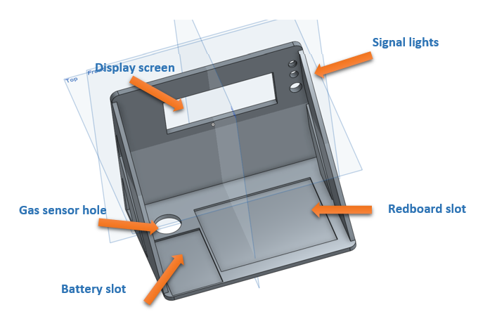

.. _fan_long_2016:

Lab-scale Gas Monitor System - Long Fan
=======================================

**Problem**

During the underground mining process (room and pillar system or long-wall
mining system) within gas-containing coal seams, gas control with an effective
ventilation system is vitally important for safety of workers and assessments.
Ventilation system monitor plays a key role in giving an instant alarm of
potential risks, such as the gas (methane) overrunning or blasting, and unstable
ventilation supply caused by other potential disasters (roof falling, fire).
Although methane and air velocity monitors has been developed and widely applied
in underground coal mines, limited amounts of monitors are placed in limited
locations due to its high cost and huge data acquisition in such a large scale.
A scaling mining system model is built in lab and the ventilation system is
built in to simulate the actual ventilation system. In order to monitor the air
flow characteristics and the gas (methane) concentration distribution of this
scaling ventilation system, lab-fit multifunction transducer is necessary to
monitor the real-time air velocity and methane concentration at different
positions of this system. Accordingly, when the monitored data exceeds a
threshold we set, a light signal can be triggered as a feedback for disaster
warning purpose. Thus, we’d like to be able to collect the real-time methane
data in the scaling ventilation system so that it can be used as a technical
support for a more efficient monitor distribution.

**Solution**

A methane sensor is going to be applied on methane concentration monitor. For
methane concentration, when it exceeds 200 ppm, the signal light will be
triggered to get people warned. The Arduino, LED and display in the SparkFun Kit
and some analog components will be used. The recommend circuit for the methane
monitor can be easily build based on the datasheet, and then, all the components
will be hooked to the Arduion, as well as the LED. The data will be showed on
the display.Two different color LEDs will shift when the methane concentration
exceeds the value we set. A small USB battery pack is needed for power supply.

**Resources**

Soldering components may be needed and hand-tools in lab will be used for basic
resembling and wire connection of sensor. No other machining or electronics
resources will be necessary.

**Items needed**

========        =============================
Quantity         Item
========        =============================
      1	         Sparkfun Redboard
      1	         Breadboard
1/bunch	         Jump wire
      1	         Methane sensor
      1	         Gas Sensor Breakout Board
      1	         USB Battery Pack
      1	         SparkFun USB LiPoly Charger
      1	         JST Right-Angle Connector
      2	         Display
      1	         Potentiometer
      2	         LED
      2	         10k :math:`\Omega` resistor
      1	         300 :math:`\Omega` resistor
      1	         3D Printed Bracket
========        =============================

**Assembling**

Since this gas monitor is going to be applied in lab, assembling is necessary to
make it compact and easily built-in. A 3D printing bracket is designed to
support all these components and to serve as a display and signal panel. Plus,
the bottom of the bracket could be connected with the ventilation model through
that gas sensor hole. 3D design of the bracket is shown below.

**Gas Sensor wiring**

A breakout board and a 10k Ω resistor are used to wire the gas sensor, the
figure below shows the gas sensor and breakout board wiring.

**Led display wiring**

A potentiometer is used to control the screen brightness. The wiring is shown below.

**Signal lights wiring**

**Battery wiring**

100 mA, 3.7v Lipoly battery is used and a JST right-angel connector is used to
connect the battery to the breadboard. Also, a USB Lipoly charger (the dark
green component) can consistently supply power.

**Testing**

Hooking up all the components and test the performance of the display screen and
gas sensor.

**Final project**

**Challenges**

1. The gas sensor is environmental sensitive. It seems when I do the test in
   different rooms, the performance will be a little different. When you keep your
   hands close to the sensor, the screen values will also change. I believe a more
   stable sensor will be selected in the future lab application.

2. From the data sheet, the gas sensor needs preheat 24hrs. It is kind of a long
   time and the sensor will get really hot. In the lab test, when I preheat the
   sensor for 3-4 hrs, most of time, it works stably. However, when I power on the
   system with this 3.7 v battery, it will take a really long time to preheat and
   we have to consider the duration of the battery although we have a battery
   charger.

Media
-----
:download:`Slides (PDF) <fan_presentation.pdf>`

:download:`Slides (PPTX) <fan_presentation.pptx>`

.. raw:: html

   

   <iframe width="560" height="315" src="https://www.youtube.com/embed/zO_vqoHIquw" frameborder="0" allowfullscreen>
   </iframe>
   

Code
----

.. code-block:: c

    #include <LiquidCrystal.h>
    #define NUM_TO_AVERAGE 500
    LiquidCrystal lcd(12,11,5,4,3,2);
    int sensorValue;
    long a0_value, a1_value, a2_value, a3_value;
    float a0_gascontent, a1_gascontent, a2_gascontent, a3_gascontent;
    void setup()
    {
      pinMode(8,OUTPUT);
      pinMode(9,OUTPUT);
      Serial.begin(9600);

      lcd.begin(16,2);
      lcd.clear();

      lcd.print("   GAS SENSOR");
      delay(2000);
      lcd.clear();
    }

    void loop()
    {
      sensorValue = analogRead(0);       // read analog input pin 0

                  if (sensorValue < 200)      // if there is little or no gas detected display blinking green light
                  {
                      digitalWrite(8, HIGH);
                      digitalWrite(9, LOW);
                      delay (500);
                  }
                   else
                  {
                   if (sensorValue >= 200)    // As the value of the gas measurement over 200, trigger the red light
                      {
                        digitalWrite(8, LOW);
                        digitalWrite(9, HIGH);
                        delay (500);
                      }
                  }
      a0_value = 0;
      for(int i=0; i<NUM_TO_AVERAGE; i++){
        a0_value += analogRead(0);
      }

      a0_gascontent = a0_value / NUM_TO_AVERAGE;

      lcd.setCursor(0,0);
      lcd.print("  GAS CONTENT:");

      lcd.setCursor(0,1);
      lcd.print("      ");
      lcd.print(a0_gascontent, 3);

      Serial.print("#1 Gas Cont=");
      Serial.print(a0_gascontent);
      Serial.print(sensorValue);
      Serial.print("#2 Gas Cont=");
      Serial.print(a1_gascontent);
      Serial.print("\n");
