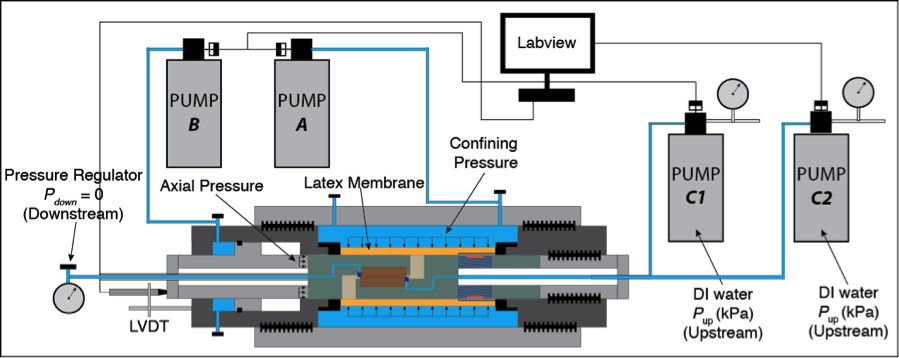
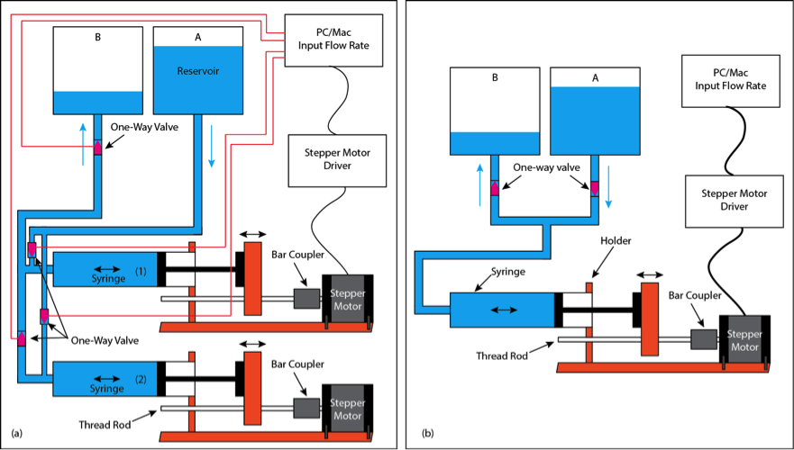
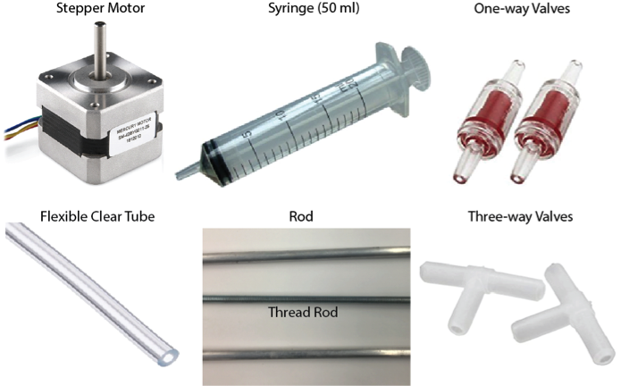
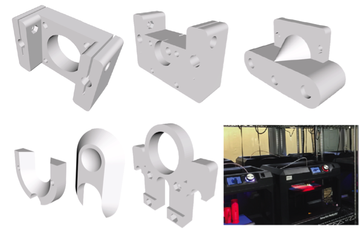
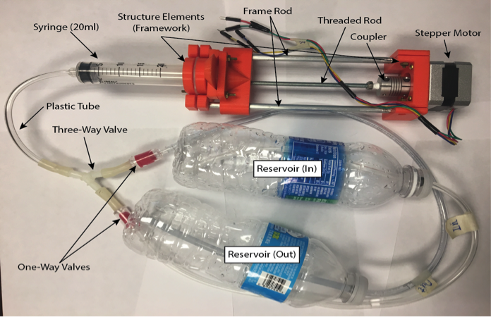
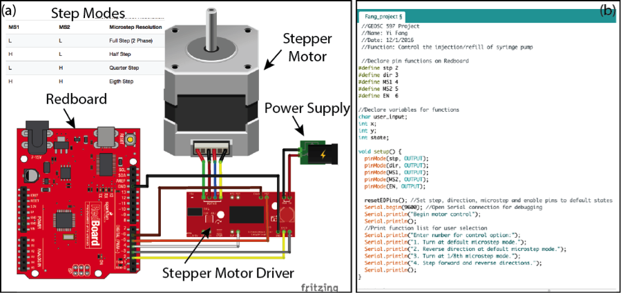
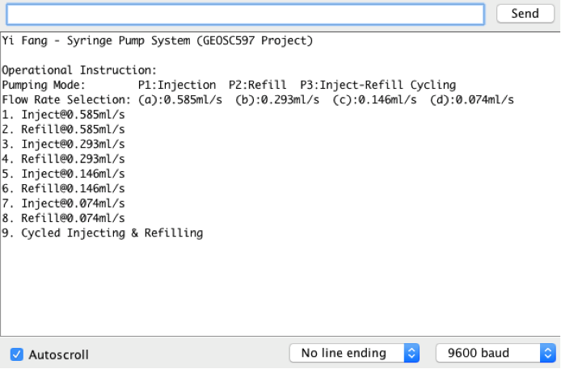

.. _fang_yi_2016:

Syringe Pump for Injecting/Refilling Fluid - Yi Fang
====================================================

**Abstract**

This report presents a process of identifying a realistic problem from
daily experimental practice, designing the prototype and manufacturing
the equipment for solving the realistic problem. A syringe pump was
designed for long-term fluid injection/refill function. The syringe pump
system is composed of structure elements, performing elements and
control system. The structure elements are designed by free Cloud CAD
suite Onshape and 3D printed by MakerBot at Penn State Library. The
performing hardware (stepper motor, syringe and tubing) is purchased to
perform injection/refill functions and the control system is designed
using Arduino to control the hardware to inject or refill. The syringe
pump prototype can be used to inject fluid and refill the fluid without
unplugging the tubing and is suitable for cycled long-term
injection/refill purpose.

**1. Identification of Problem**

**1.1 Realistic Problem**

Long-term fluid injection is vital for the success of in-house
laboratory experiment. It is essential for pump to perform continuous
injection. However, most pumps used in the lab experiments are
commercial with limited volume (100 to 500 ml), in such a case, fluid
injection may be disrupted because the tubing has to be unplugged from
the running system and connected to reservoir for refilling (**Figure
1**).

|image0|

**Figure 1.** Schematic graph showing realistic problem: two pumps (C1
and C2) alternatively inject/refill the fluid.

**1.2 Prototype and Simplification**

The realistic problem can be solved by programming via Labview to
accommodate two pumps alternatively injecting and refilling. To achieve
the goal of this class - learn, explore and practice, a prototype of the
realistic problem is developed to accomplish similar targets. Ideally, I
would like to design a pump injection system composing of two syringe
pumps that allow injection and refill acting simultaneously **(Figure
2a)**. However, to reduce the budget, I performed a necessary
simplification in which the number of pump is reduced to one and the
injection/refill switch is performed by accommodation of one-way valves
**(Figure 2b)**.

|image1|

**Figure 2. (a)** Ideal version of syringe pump system as analogue to
realistic problem **(b)** Simplified prototype of syringe pump system

**2. Method**

**2.1 Pumping Hardware and Structure Elements**

The pumping hardware is composed of a plastic syringe (20 ml), a stepper
motor, a threaded rod with 4 nuts, a rod coupler, two one-way valves,
one three way, a plastic tube and two plastic bottles, which are
illustrated in **Figure 3** and the budget of each component is listed
in **Table 1**. The hardware is then assembled with the structure
elements (**Figure 4** and **5**). The structure elements were designed
by an online open-source CAD (Onshape) and were 3D printed by MakerBot
at Penn State Pattee Library.

|image2|

**Figure 3**. Major hardware component of syringe pump system

**Table 1**. Material and Budget

+------------+------------------------+----------+
| Quantity   | Item                   | Cost     |
+============+========================+==========+
| 1          | Syringe with tubing    | $8.97    |
+------------+------------------------+----------+
| 1          | Stepper Motor          | $14.95   |
+------------+------------------------+----------+
| 1          | Body holder            | $0       |
+------------+------------------------+----------+
| 1          | Driving rod            | $0       |
+------------+------------------------+----------+
| 2          | Supporting rod         | $0       |
+------------+------------------------+----------+
| 1          | Two way tube           | $5.67    |
+------------+------------------------+----------+
| 1          | Plastic tank           | $5.0     |
+------------+------------------------+----------+
| 2          | Check valve            | $24.16   |
+------------+------------------------+----------+
| 1          | Three way tube joint   | $0       |
+------------+------------------------+----------+
| 1          | Wood block             | $0       |
+------------+------------------------+----------+
| 1          | Rod Coupler            | $6.0     |
+------------+------------------------+----------+
| 1          | Stepper Motor Driver   | $14.0    |
+------------+------------------------+----------+
| 1          | Thread Rod             | $6.0     |
+------------+------------------------+----------+
| 1          | Rod                    | $0.0     |
+------------+------------------------+----------+
| 2          | Nut                    | $0.0     |
+------------+------------------------+----------+
| Total      |                        | $84.75   |
+------------+------------------------+----------+

Note: Those labeled as $0 are available in lab.

|image3|

**Figure 4**. 3D geometry of structure elements

|image4|

**Figure 5.** Assembled syringe pump system

**2.2 Control System**

The control system is composed of three parts: Arduino Redboard, Stepper
Motor Driver and Arduino code (**Figure 6**). The Arduino code is first
programmed and then uploaded to Arduino Redboad and Stepper Motor
Driver. The commands are input via series monitor in Arduino software
tools and are sent to Stepper Motor to perform the functions such as
move forward or backward to control injection or refill of syringe. In
this system, we developed four injecting flow rates (i.e., 0.585ml/s,
0.293ml/s, 0.146ml/s, and 0.074ml/s) based on the rotating rate of
Stepper Motor (i.e., full, half, quarter, and 1/8\ :sup:`th` rotation
rate). To send the command to the syringe pump, we use Arduino Series
Monitor to input the desired injection/refill mode. **Figure 7** shows
the interface of Arduino Series Monitor, in which 9 injection/refill
modes are listed for reference. Particualarily, for long-term
injection-refill process, mode 9 is selected.

|image5|

**Figure 6**. The Ardunio Redboard and Stepper Motor Driver together are
used to send injection/refill command to the physical hardware (*i.e.,*
Stepper Motor) to drive the syringe

|image6|

**Figure 7.** Interface of syringe pump control system

**3. Challenges and Solutions**

In developing the syringe pump system, following small challenging
issues are encountered:

(1) Limited budget for solving realistic problem. To solve this problem,
the simplest way is to simplify the problem. As shown in **Figure 2**,
the realistic problem is simplified to an analogue version that still
has the desired functions.

(2) Unmatched size between syringe and structure element: the problem
was resulted from designing the structure element before syringe was
purchased and delivered. This problem was easily solved by replacing the
syringe with an appropriate size that matches the structure elements.

(3) Calculating and calibrating the flow rate: as no sensor is used to
monitor the fluid volume, the only way to calculate the flow rate is by
counting how much time it needs for syringe to pump out 20 ml water. In
other words, this time is the same time that stepper motor needs to move
forward a certain distance. After a series of tests, the precise flow
rates are confirmed as illustrated in **Figure 7**.

**Acknowledgement**

I appreciate our lecture Mr. John Leeman for ordering the project
hardware for me and for his great lectures and guide in the class.
Thanks to Dr. Chris Marone for his kind help throughout the class.

Media
-----
:download:`Slides (PDF) <fang_presentation.pdf>`

:download:`Slides (PPTX) <fang_presentation.pptx>`

:download:`Code (ZIP) <fang_code.zip>`

.. raw:: html

  

  <iframe width="560" height="315" src="https://www.youtube.com/embed/r5B9xLhNq-4" frameborder="0" allowfullscreen>
  </iframe>
  

