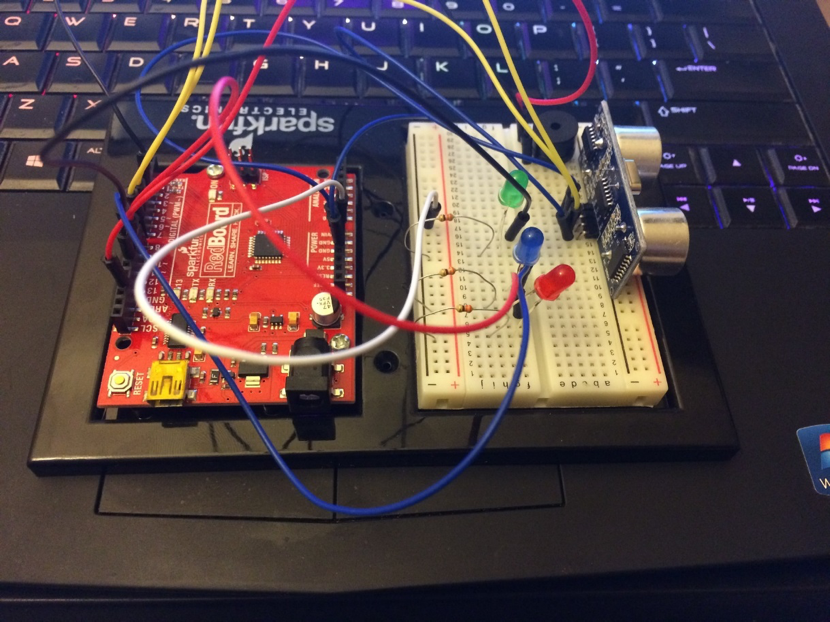
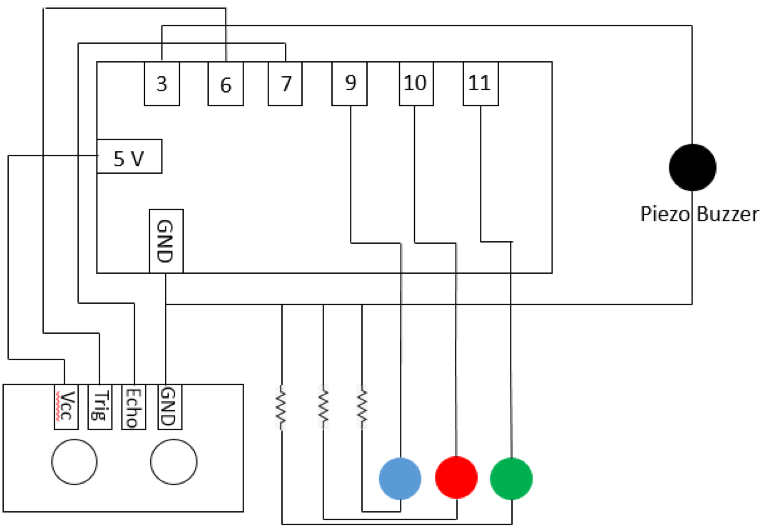
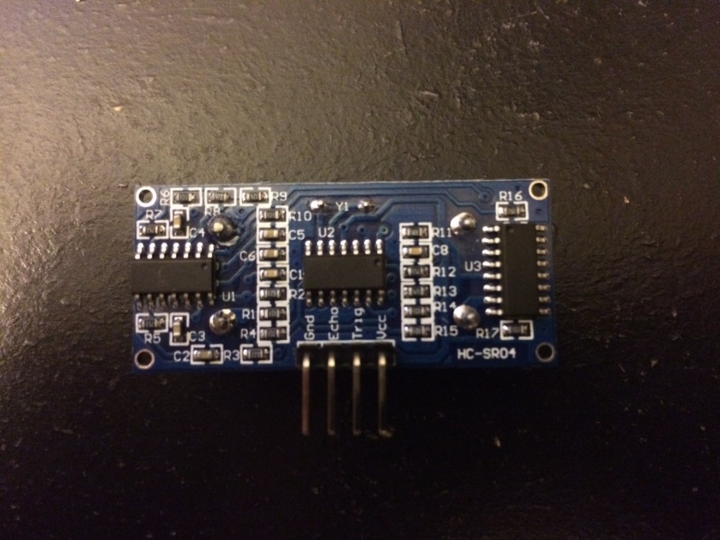
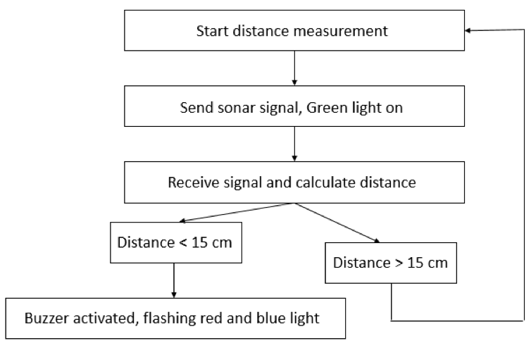

.. _hu_guanglong_2016:

Arduino Alarm System - Gauanglong Hu
====================================

**Problem**

I had a very bad experience of burglary when I was a sophomore in undergraduate
school about four years ago. I thought where I was living was a very safe place
and I did not have a habit to lock the door. When I was reviewing for the exam
in the morning about 2 am midnight, someone entered my room and tried to steal
something. Fortunately, the person saw me awake and he fled immediately and
nobody was hurt. This experience had haunted me for about two years and I could
not fall asleep if I did not check whether the door was locked and with a
baseball bat beside my bed. Moreover, there are some violence and crimes against
specific ethic group. There was a song called “Meet the Flockers” by YG. The
lyric is a standard operation procedure to motivate people how to rob a Chinese
people. After the song was published, there have been some fatal home invasions
targeted Chinese residential area. However, the most important thing is that I
cannot possess a fire arm legally as a legal immigrant. Therefore, an alarm
system will become helpful. It can generate high pitch sound to wake me up and
also possibly scare burglars away. It can also mimic the light effect on police
vehicle.

**Methods**

The alarm system was built using a distance sensor, a piezo buzzer, a blue LED,
a green LED, a red LED, Sparkfun red board, and a bread board. The alarm system
is shown in Figure 1 and the schematic shows the connection in Figure 2. The
method to detect whether someone have broken in is to put the alarm system
somewhere near the door and it will detect the distance between the distance
between the door and the system itself. If the distance is smaller than the
previously specified value in the code, the alarm will be triggered.

   Figure 1. Arduino alarm system

  Figure 2. Connection of Arduino alarm system

**Challenge**

The challenge I encountered in this project is that I did not know how does the
distance sensor worked. As shown in Figure 3, the distance sensor is a
SR04-Ultrasonic Distance Measurement Sensor and it has four different pins. The
GND and Vcc are used to connect to the GND and 5-volts power supply portal on
the Sparkfun red board. The “Trig” pin is used to command the sensor to send
sonar signal to objects in front of it. The “Echo” pin is used to receive the
signal reflected back from the objects and record the time consumed for the
signal to come back after it was sent.

  Figure 3. SR04-Ultrasonic Distance Measurement Sensor

**How it works**

After the code is uploaded to the Sparkfun red board, the green light is on to
indicate that the alarm system is armed. If an object is put in front of it and
the distance is smaller than the specified value in the code, the alarm will be
triggered. The piezo buzzer will generate high pitch voice at a specified
frequency and blue and green light will flash. The state machine diagram is
shown in Figure 4.

  Figure 4. State machine diagram of Arduino alarm system.

Media
-----
:download:`Slides (PDF) <hu_presentation.pdf>`

:download:`Slides (PPTX) <hu_presentation.pptx>`

.. raw:: html

  

  <iframe width="560" height="315" src="https://www.youtube.com/embed/VOIWvHQJUBA" frameborder="0" allowfullscreen>
  </iframe>
  

