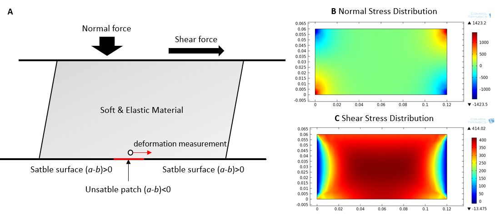
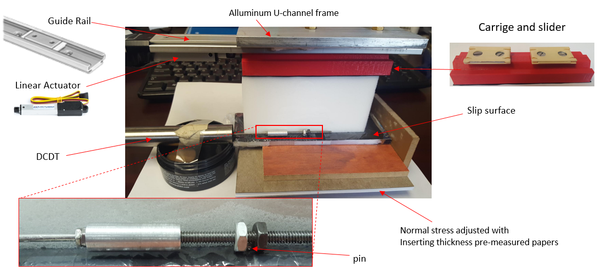
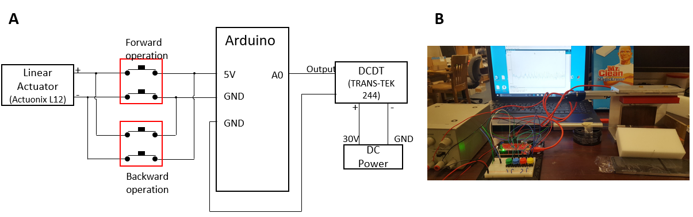
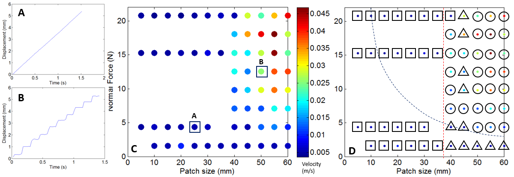

.. _kj_im_2016:

Sponge-quake Shear Box - Kyungjae Im
====================================

**Problem Description**

Earthquake is typically demonstrated by stick-slip motion in laboratory.
Although experiments successfully describes substantial mechanism of earthquake,
it has been not enough to reproduce natural earthquake since typical experiments
only have single degree of freedom while natural earthquakes occurs on two
dimensional fault plane with complexly distributed frictional properties.
Increasing dimension of laboratory stick-slip would show a lot further
information such as slip behavior on a plain with series of different frictional
properties, earthquake nucleation, stress and slip purse propagation and so on.
However, although there are several recent successful observations for
laboratory induced multi-dimensional slip, the experiments are expensive and
also requires huge care because rock is too stiff so deformations becomes too
tiny to be measured and large dimension of rock mass and apparatus are required.

**Proposed Solution and Requirements**

To observe multi-dimensional slip behavior on distributed frictional property, a
shear box with a soft shearing body is proposed for class project. First and
most important requirement is to find such low stiffness but highly elastic
material that represents an ��earth�� in earthquake. Initial candidates were (i)
sponge, (ii) styroform and (iii) rubber. Several sponges were tested first and
an appropriate candidate that is generate localized slip and stiff enough was
selected.

To fulfill to goal of the proposal, following items are required to be further
satisfied

*	Uniform normal & shear application

*	Unstable patch within stable surface

*	Deformation measurement

Fig. 1A shows simplified mechanical framework of proposed shear box. It shows how boundary normal and shear stresses sould be applied on the shear body. Unstable patch will be placed on the bottom of the sponge and measurement will be made right on the top of the patch. Fig. 1B and 1C shows simulated normal and shear stress distributions after applying shown boundary forces. Resulted stress field are not perfectly uniform, but seems to be good enough at least near the unstable patch.

  Figure 1. A: Simplified mechanical framework of proposed shear box. B and C represents simulation results when boundary forces shown in A are applied.

**Final Design**

Several different mechanical design were proposed and configuration of Fig. 2 is
selected as a final design. Overall apparatus is framed by aluminum U shaped
bar. I bought a guide rail and two carriages to minimize frictional resistance
when shearing the top of sponge. The carriage is bolted to a slider that can
cover the top area of sponge. Slider bottom is covered by a rubber patch so that
the shear force can be well delivered to sponge. Commercial linear actuator
(Actuonix L12) is used to push slider. Bottom friction surface is made by rubber
partly covered by kitchen wrap. I checked that kitchen wrap / sponge contact
always shows stable sliding and rubber / sponge contact shows unstable
stick-slip. Therefore size of unstable patch in this experiment is controlled by
coverage of kitchen wrap and exposed sized of rubber.

For deformation measurement, Sparkfun flex sensor was initially considered. The
sensor indeed can measure the displacement of sponge but resolution was poor.
The sensor is changed to DCDT. Connecting the DCDT to separate 30V power supply
connected to Arduino analog input (10bit, 1023 step) can yield displacement
resolution as small as 5��m which can be good enough to this prototype shear
box. DCDT is connected to a pin that is firmly held at the bottom of the sponge.

  Figure 2. Final design and major components of shear box.

**Electric circuit**

Two power sources are used: (i) Arduino 5V for powering linear actuator and (ii)
separated 30V DC power to supply current to DCDT. Arduino breadboard and push
switches are used to manage current direction to linear actuator in which way
forward and backward operation can be controlled. DCDT output signal is
connected to Arduino analog input and sent to computer to analyze.

  Figure 3. Electric circuit diagram (A) and fully connected sponge-quake shear box.

**Experiment set up and Results**

12 different patch size with 8 normal stress are tested. Patch size starts from
5mm increased by 5mm until 60mm. Normal forces starts from 1.6N (0.5kPa, no
paper) with increase by 2.74N (normal force increase with 10 papers) until 20.8N
(6.4kPa, 70 papers inserted). Experiments on each patch size starts from no
paper (1.6N), then 10 papers (4.3N). If slips are stable with 10 papers, I
jumped to 50 papers (15.3N) and then 70 paper (20.8N). First stick-slip was
detected at 40mm / 1.6N and then further experiment almost always shows
stick-slip.

Fig. 4A and 4B show two different mode of sliding. A is stable displacement
response of 25mm/4.3N and B is displacement response of 50mm/12.5N case.
Difference can be clearly seen B shows clear stick-slip motion while A shows
stable sliding. Displacement of each slip event shown in Fig. 4B is ~ 0.7mm
which is far larger than the displacement that we typically observes in rock
shear experiment. This shows that this sponge-quake can be utilized to indirect
observation of earthquake slip behavior.

Plot C and D represent maximum slip velocity (C) and observed stability (D).
Observation of slip velocity shows slip velocity increases with both patch size
and normal force. Note that 0.005m/s is actuator velocity at no loading. So
0.005m/s represents stable sliding. Markers in Plot D denotes observed
stability: square ? stable, triangle ? stable and unstable mixed and circle ?
unstable. Interesting observation is that the stable-unstable criteria seems to
be solely dependent on patch size. Theoretical and experimental analysis says
the nucleation length is also dependent on normal stress. More experiments are
required to see if this observation is repeatable.

  Figure 4. Experimental result.

**Problems and Further Upgrade Items**

I expect this sponge-quake can reproduce substantial mechanism of natural
earthquake in distributed frictional properties. Biggest problem of this
prototype shear box is that sampling interval is too large (~20ms) at Arduino
analog input which is not enough to observe pre-slip and accurate peak velocity
in stick-slip motion. And also longer sponge is required to apply uniform normal
and shear stress throughout the sponge body. Current boundary force application
yield higher normal stress concentration on sponge front (fig 1) so normal
stress decreases as the sponge slips. Further, to have better observation of
natural earthquake behavior, several things can be upgraded such as multiple
loading velocity, using gouge as a frictional surface and/or multiple point to
measure slip propagation.

Media
-----
:download:`Slides (PDF) <im_presentation.pdf>`

:download:`Slides (PPTX) <im_presentation.pptx>`

.. raw:: html

  

  <iframe width="560" height="315" src="https://www.youtube.com/embed/PLz-Y0F4tPg" frameborder="0" allowfullscreen>
  </iframe>
  

