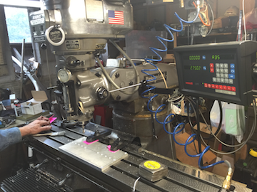

.. _leeman_john_2016:

Example Project - John Leeman
=============================

This is an example project to help students see how to format their
submissions for pull requests and will be removed after several student
postings are present.

  
  An insightful caption about this image

More text about my amazing project. You can also link to `Cool Places <http://www.johnrleeman.com>`_
