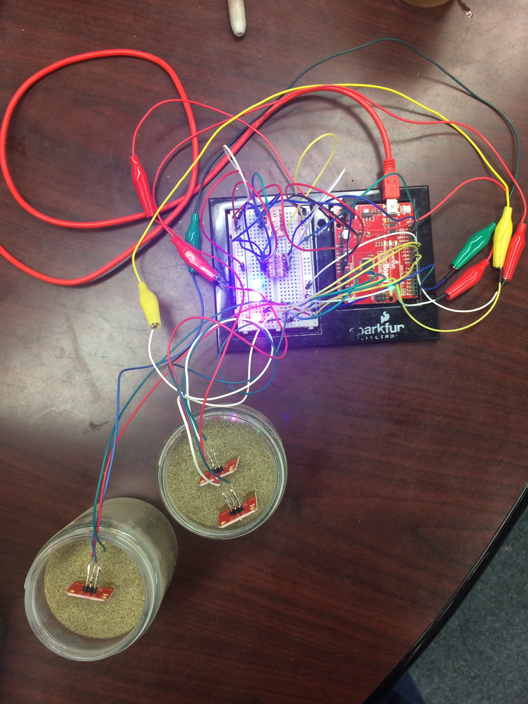

.. _miller_peter_2016:

Temp & soil moisture sensor for plants with web based data acquisition - Peter Miller
=====================================================================================

**Problem description and solution**

The purpose of this project was to create an Internet of Things (IoT)
weather station that also incorporated a soil moisture-monitoring
component. The device is intended to notify the user when the moisture
content of the soil drops below a certain value. To notify the user that
the moisture content of the soil is too low, 3 LED’s, which correspond
to the three soil moisture sensors, will turn on. The initial idea was
to feed all of this data onto a server designed to handle IoT projects
and then plot the data continuously. In practice I was able to record
all of the data to a hard drive but was unsuccessful in streaming it to
a web service. Because of this roadblock I have written a python module
to read in and plot the recorded data with only a single input from the
user. This project is also described in a state machine diagram (figure
1), which shows the workflow of the device.

**Hardware and software solution**

The atmospheric data is collected by a BME-280 breakout board, which was
purchased from Sparkfun. The temperature is recorded in degrees C,
relative humidity in %, altitude in meters, and atmospheric pressure in
Pascal’s’. This breakout board has the capacity to transmit data using
both the SPI and I\ :sup:`2`\ C protocols. For this project I used the
I\ :sup:`2`\ C protocol because space on my breadboard and the
connecting wires were finite commodities. Since this board required
3.3V, a logic shifter was needed to step the output signal up so that
the 5.0V SDA and SCL serial ports on the Arduino can read the data. The
original Arduino code for the BME-280 was borrowed from Sparkfun and
modified to support three soil moisture sensors and the LED warning
lights.

To measure soil moisture I had three Sparkfun soil moisture sensors
(SEN-13322). The moisture sensor functions as a variable resistor where
the voltage between the two pads is a function of the conductivity of
the soil. The conductivity of the soil increases as the volumetric water
content, or total volume of water in the porous soil increases. When
connected to the analog input of the Arduino, these sensors only throw
values between 0 (perfectly dry) and 900 (100% saturated) instead of 0 -
1023. And since the maximum saturation of soil is roughly equal to the
critical porosity of the soil or ~50%, I defined a linear saturation
scale between 0 and 100%. At 100% the soil is effectively a colloidal
material (mud). A perfectly dry soil ideally has an output voltage of
zero because the constituent minerals are non-conductive. The lower
limit that I placed on the moisture content of my soil was 250 or 27%.
At or below this value the light will start flashing indicating that the
plant needs water. See figure 2 for image of setup.

A simple calibration was performed in order to convert the serial output
from the soil moisture sensor to a percent saturation. The two soil end
member cases (colloidal sand and dry sand) were measured to determine
the minimum and maximum output values. Since the relationship between
the output values and the percent saturation was assumed to be linear,
the ratio of the output value to the maximum value was assumed to be the
percent saturation.

Finally, to visualize the data I wrote a python module that sorts and
plots the data collected from the atmospheric and soil moisture sensors.
The module works only on CSV data files and allows the presence of a
header. The plots generated are saved as individual pdf documents to a
specified directory. For more information please see the commented code.

**Issues**

The two data collection systems all functioned properly, however, the
final goal was to make this data available online through IoT services
like Thingspeak or data.sparkfun. I was unsuccessful in interfacing the
ESP8266 WiFi module with one of the services largely due to an inability
to send the module AT serial commands programmatically. The ESP8266
module allows a microcontroller to access the local WiFi network through
standard TCP/IP protocols. The AT commands pre-loaded into the firmware
allowed me to access IoT services through direct user input as serial
commands, however automating these commands proved elusive.

**Next Steps**

This device both collected data continuously for an extended period of
time and functioned as an alert device if the soil moisture dropped
below the specified value. As a concept device this project worked.
However, there are a few steps (listed below) needed to make this an
automated IoT device.

1. Consolidate wiring and modules onto a smaller board so that it will
   fit into a reasonably small waterproof case. The soil moisture
   sensors are waterproof and so they are able to function in the
   environment.

2. Fix the program for WiF connectivity. This is close to working but
   the issue of programmatically sending serial AT commands needs to be
   fixed and/or circumvented.

3. Generate an automated alert system that will either text or email the
   user when the soil moisture reaches a dangerous level for the plant
   that is being monitored.

   |image0|

   Figure 1: State machine diagram for soil moistures sensor. Once the
   initialization process takes place, the data is collected and the
   system checks the soil moisture. If it falls below the critical value
   of 27% then the LED attached to that sensor will turn on.

   |image1|

Figure 2: wiring setup between temperature sensors, soil moisture
sensors, and the Arduino. The soil moisture sensors in this image are
placed in the sand. The LED’s in this image are both signifying the sand
is below the critical water content of 27%.

Media
-----
:download:`Slides (PDF) <miller_presentation.pdf>`

:download:`Slides (PPTX) <miller_presentation.pptx>`

:download:`Code (ZIP) <miller_code.zip>`

.. raw:: html

 

 <iframe width="560" height="315" src="https://www.youtube.com/embed/VMQ81J5DwFM" frameborder="0" allowfullscreen>
 </iframe>
 

