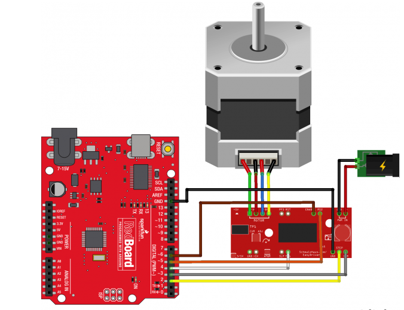
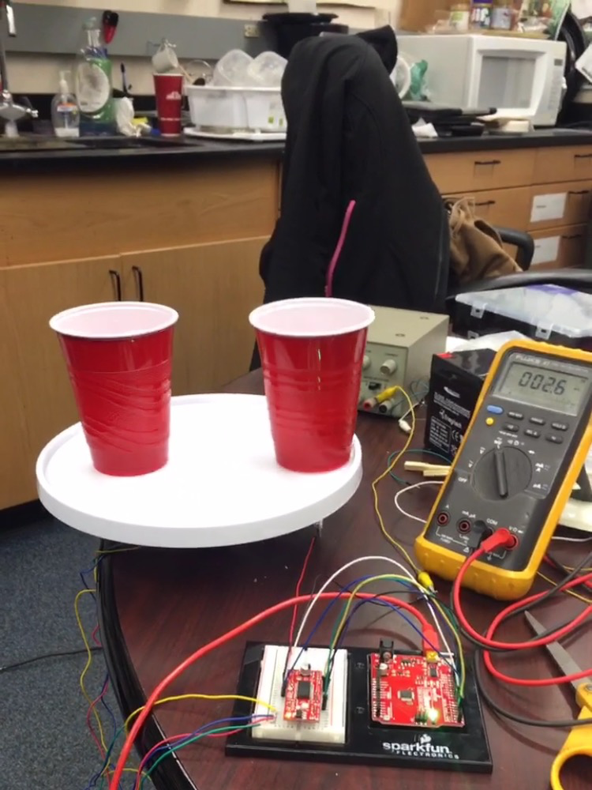
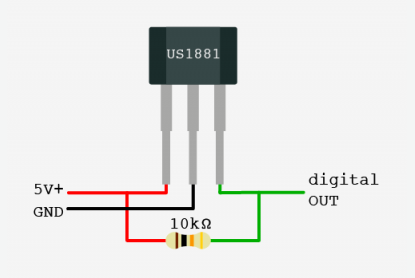

.. _ryan_kerry_2016:

Shot Spinner - Kerry Ryan
=========================

**Problem:**

I wanted a way to entertain guests at parties and other social
gatherings. What better way to impress your friends than with science
AND beer!

**Intended Solution:**

My plan was to design an automatic beer-dispensing device. A step motor
controlled platform that will rotate beer glasses underneath a spigot to
be filled. Hall effect sensors will be used to identify when a glass is
in position to be filled. The glasses will be filled from a large
pitcher located in the center of the device.

Device Requirements:

1) Rotating table to put cup/container under spout

2) Sensor to identify when cup/container is present

3) Valve to control flow of liquid into container

**Design Process:** A lesson in resourcefulness, repurposing, and
resilience

To start the design process I began by developing a state diagram to
layout how I intend my device to work and to make sure that it would
meet all of the requirements. Shown on the next page is my original
state diagram.

State Diagram:

Part 1: Rotating Platform

I started off my project by trying to get the platform rotating. The
idea was to use a stepper motor and a series of 3D printed gears to spin
the platform. However, I had difficultly finding a lazy Susan that was
appropriate for this project. Most of the ones I found online were made
of glass and too heavy and/or large for this project. I found a smaller
plastic one online. When the lazy Susan arrived I noticed that it was
difficult to turn and did not roll smoothly on its bearings. The
specifications of the item did not list how high off the surface the
platform would be. These two factors made it difficult to set up the
rotating platform the way I had planned.

Instead, I decided to try and mount the platform on top of the motor.
The motor has a circular end which made it difficult to secure beneath
the platform. Using a series of wooden rods and zip ties I was able to
secure the platform on top of the motor. Some plumbers putty was used
for additional stability.

Part 2: Operating the Motor

The next step was to set up the electronics for the motor. I used a 4
wire bipolar motor and easy driver from Sparkfund. Shown below is a
hookup schematic from the Sparkfund website.

|image0|

Figure 1: Schematic of stepper motor hookup. Details can be found on the
Sparkfund website
(https://learn.sparkfun.com/tutorials/easy-driver-hook-up-guide?_ga=1.133038150.938360751.1472576888).

Shown below is a picture of my actual set-up. The first time I attempted
to setup the motor I was reading very low current that I believe was
insufficient to power the motor. The setup required 6 solder connections
and I believe that one of them may not have been very good. I took the
setup apart and checked the connections. I re-soldered two of the
connections and tried the setup again. Thankfully, this time it worked!
The motor was successfully turning the platform.

|image1|

However, at this point I came across my next obstacle. The platform was
not very stable because of the way the motor was attached. Given this
configuration it cannot support a lot of weight, i.e. cups of beer as it
rotates. To remedy this, I decided using smaller plastic cupswith \\
would be more feasible. With smaller cups and less liquid, the platform
would be less likely to tip to the side.

Part 3: Hall Effect Sensors

The hall effect sensor is a transducer that changes its output voltage
based upon the magnetic field. Specifically, I used a Melexis US1881
sensor from Sparkfund. This sensor is a latch sensor meaning that once
the sensor detects a certain magnetic field it will stay in that state
until it measures a magnratic field of the opposite polarity. To
implement this in our design, the idea was to put magnets of alternating
polarity on the platform so that when the magnetic field changed state
the device would know that a new cup was ready to be filled.

The hall effect setup is shown below:

|image2|

Figure 3: Hall effect sensor schematic.

http://bildr.org/2011/04/various-hall-effect-sensors/

Part 4: Dispensing Valve

To dispense the beer and/or any beverage of your choosing, I purchased a
solenoid valve, food safe plastic tubing and a beer pitcher.
Unfortunately, the valve I purchased was not appropriate for this
project. The documentation on the website was not very clear to me and
the valve required assembly parts that I did not purchase. Without this
part, I had to rethink what my device could do. At this point, rather
than making a beer dispenser I decided to make a shot spinner. A fun
game that guests could play.

Part 5: Finalizing the shot spinner

The idea of the shot spinner is you place already filled small cups on
the platform. Players sit around the platform. The game begins when you
press a button located on the arduino board. The arduino randomly
generates 2 numbers (which uses randomseed to start at a different place
in the random number sequence each time) . The first number (0-100)
determines if the platform roatates clockwise (0-50) or counterclockwise
(51-100). The second number (1-2000) determines how many steps the motor
takes i.e how far does it turn. When the platform stops the person with
the shot drinks it. At this point you refill the cups and go again!

To make the shot spinner functional I programmed my Ardiuno as a state
machine.

Initial State Check Button State Random Number Generator State Forward
Rotate State or Backward Rotate State Check Button State

The process repeats this way. The default/shutdown case does not move
the motor.

Future work: Along the way I encountered a number of problems that could
be addressed in future modifications of this device. For one, investing
in a quality rotating platform or designing a custom made platform for
your purpose is important. It would be nice to have a lightweight but
stable rotating platform that could support the full weight of pint
glasses.

In addition, finding an appropriate valve to regulate flow would be
desired. The automatic refilling could also be incorporated in to shot
spinner.

In addition, this device can be repurposed for many useful tasks. Ever
have trouble deciding what is for dinner? Write different ideas down and
put them in the cups. Use the spinner device to pick for you! Or is
there ever a certain task that needs to be done but no one is
volunteering to do it? Put everyone’s name is the spinner and push the
button to make the final decision!

Code - Project
--------------

.. code-block:: c

    // Shot Spinner by Kerry Ryan
    // Segments of code modified from Sparkfund Easy Driver Hook-up Guide

     //Declare pin functions on Redboard
    #define stp 2
    #define dir 3
    #define MS1 4
    #define MS2 5
    #define EN  6

    //Declare variables for functions
    char user_input;
    int x;
    int y;
    int state;
    int randNumdir;
    int randNumturns;
    const int button=12;

    // Identify Different States
      const int ButtonTrigger=0;
      const int RandomNum=1;
      const int ShotSpinForward=2;
      const int ShotSpinBackward=3;

    void setup() {
      pinMode(stp, OUTPUT);
      pinMode(dir, OUTPUT);
      pinMode(MS1, OUTPUT);
      pinMode(MS2, OUTPUT);
      pinMode(EN, OUTPUT);
      pinMode(button,INPUT);
      resetEDPins(); //Set step, direction, microstep and enable pins to default states
      Serial.begin(9600); //Open Serial connection for debugging
      Serial.println("Press button to begin!");
      Serial.println();
      randomSeed(analogRead(0));
      digitalWrite(EN, LOW); //Pull enable pin low to allow motor control
    }

    void loop() {
      // Start of in Random number generator case
       static int state = ButtonTrigger;

        switch(state) {

          case ButtonTrigger:
          //Wait for Button Trigger Case
          if (digitalRead(button)==HIGH){
            state=RandomNum;
          }
          else{
            state=ButtonTrigger;
          }
            break;

          case RandomNum:
          //Random Number Generation
          randNumdir=random(0,100);
          randNumturns=random(1,2000);
          delay(100);

          if (randNumdir>50){
            state=ShotSpinForward;
          }
          else{
            state=ShotSpinBackward;
          }

          break;

          case ShotSpinForward:
          // Platform will rotate forward randNumturns steps
          Serial.println("Shots! Shots! Shots! ");
          digitalWrite(dir, LOW); //Pull direction pin low to move "forward"
          for(x= 1; x<randNumturns; x++)  //Loop the forward stepping enough times for motion to be visible
          {
            digitalWrite(stp,HIGH); //Trigger one step forward
            delay(5);
            digitalWrite(stp,LOW); //Pull step pin low so it can be triggered again
            delay(5);
          }
          Serial.println("Refill! Then push button again!");
          state=ButtonTrigger;

            break;

          case ShotSpinBackward:
           Serial.println("Party! Party! Party!");
           digitalWrite(dir, HIGH); //Pull direction pin high to move in "reverse"
            for(x= 1; x<randNumturns; x++){  //Loop the stepping enough times for motion to be visible
              digitalWrite(stp,HIGH); //Trigger one step
              delay(5);
              digitalWrite(stp,LOW); //Pull step pin low so it can be triggered again
              delay(5);
              }
              Serial.println("Refill! Then push button again!");
              state=ButtonTrigger;

          default:
            // Shutdown Case
            while(state>3){
              resetEDPins();
            }

        }
     }
    //Reset Easy Driver pins to default states
    void resetEDPins()
    {
      digitalWrite(stp, LOW);
      digitalWrite(dir, LOW);
      digitalWrite(MS1, LOW);
      digitalWrite(MS2, LOW);
      digitalWrite(EN, HIGH);
    }

Code - Hall Sensor
------------------

.. code-block:: c

    const int magstate=7;
   int sensorVal;
   const int light=9;

   void setup() {
     // put your setup code here, to run once:
   pinMode(magstate, INPUT);
   Serial.begin(9600);
   }

   void loop() {
     // put your main code here, to run repeatedly:
   sensorVal=digitalRead(magstate);
   Serial.println(sensorVal);
   delay(500);
     if(sensorVal==1){
      digitalWrite(light, HIGH);
      }
   else{
     digitalWrite(light, LOW);
   }

   }

Media
-----
:download:`Slides (PDF) <ryan_presentation.pdf>`

:download:`Slides (PPTX) <ryan_presentation.pptx>`

.. raw:: html

 

 <iframe width="560" height="315" src="https://www.youtube.com/embed/ovFl6-Qer14" frameborder="0" allowfullscreen></iframe>
 

