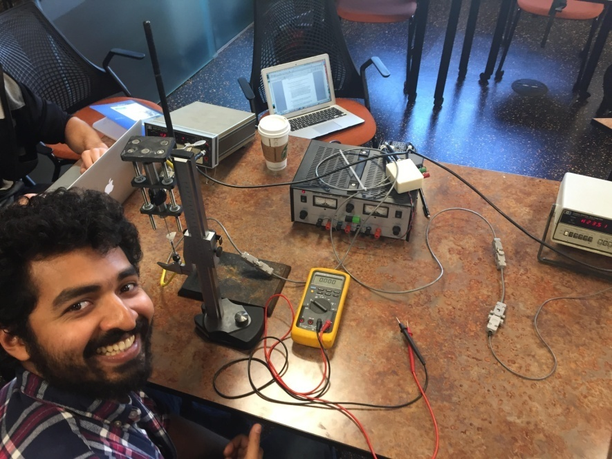
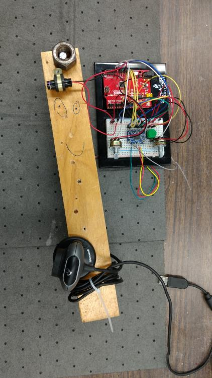
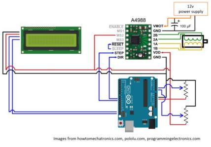
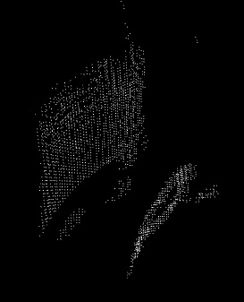

.. _shreedharan_srisharan_2016:

3D Laser Profilometer - Srisharan Shreedharan
=============================================

|image0|

**The problem:**

Pre- and post-shear analysis of rock samples in any rock mechanics lab
would be well complemented by including information about the surface
roughness of the sheared sample. This is commonly achieved by 3D
photogrammetry or laser profilometry. My project builds a low cost 3D
laser profilometer which may ultimately be used to scan the sheared
surfaces of intact rock samples at Penn State's Rock Mechanics Lab. The
scanner is a sub $30 prototype which will be improvised to incorporate
higher resolution capabilities for use with smoother joint and fault
surfaces.

**Methods:**

The product that I built is loosely based on two online instructables.
The general principle behind the working of this profilometer involves
the use of a line laser module and a webcam in tandem. The webcam
‘looks’ at the object that the line laser shines on and the code selects
the ‘red’ pixels above a user specified threshold and saves them. Based
on the distance between the webcam and line laser module, their distance
from the object, and their respective geometric angles (as formed by the
webcam,line laser and the object being scanned as vertices of a
triangle), the code adjusts the point cloud to create a scan of the
object.

I used the following resources for my project:

a) Sparkfun RedBoard and associated parts (eg. jumper cables, breadboard
   etc.)

b) 10k potentiometers x 2

c) Line laser module

d) Logitech webcam

e) NEMA 17 stepper motor (200 steps/revolution or 1.8\ :sup:`o`
   resolution)

f) TB6612 Stepper driver

g) 100 uF capacitor

h) Open source codes – Arduino 1.6.11 and Processing 3.2.1

Two broad mechanisms for the movement and position feedback are possible
– seating the object to be scanned on a turnstile or moving the scanner
(line laser and webcam) mechanism. I opted for the latter since it
provides greater flexibility on the size and weight of the object to be
scanned since it will neither be limited by turnstile size nor stepper
motor torque.

To construct the mechanical side of the project, I took a plank of wood
(33 cm x 5 cm x 2 cm) and named him Plank. I drilled a #20 pilot hole
(11/64”) through the center of Plank (16.5 cm, 2.5 cm) and chiseled a
side of it so as to get a ‘D’ shaped hole to snugly hold the NEMA 17
stepper motor’s ‘D’ shaped shaft. I mounted the line laser on one end of
Plank and the webcam on the other end, with the RedBoard sitting at the
center of my arrangement. Since the scanner had a weight imbalance as
is, I added counterweights on the line laser side of Plank. The line
laser was oriented perpendicular to Plank and the webcam makes a
20\ :sup:`o`-40:sup:`o` angle with it. A completely built prototype is
shown in figure 1.

|image1|

Figure 1: The completed mechanical build of the laser scanner

The electric build is relatively straightforward and figures 2 and 3
show the schematic and actual electric build I used in my project. The
schematic shows an optional LCD screen that could have been used to see
the speed and total angular movement of the device mapped to the two
potentiometers, which I do not include in my project for lack of an I2C
LCD. The schematic also shows the wiring for an A4988 stepper motor
instead of the TB6612. I also include a button (not in schematic in
figure 2) which restarts the device after each scan cycle if the user
desires.

|image2|

Figure 2: Schematic of the electric circuit

The Arduino code controls the physical aspects of the device. The device
starts as soon as it is powered and steps from its starting point to a
final angle (<360:sup:`o`) and a predefined speed, both of which are
controlled by the two potentiometers. The scan occurs from 0 – final
angle, at each step, after which the device steps back to its original
position ‘0’. The processing of the scan occurs in a Processing sketch
in tandem. The processing sketch A should be running during the scan
sequence since it records the object’s reds as seen by the webcam and
writes the coordinates into a file. Processing sketch B can be used
after the scan to load the coordinates’ file, which it processes to
provide a final point could of the scanned object. Sketch B requires the
webcam angle relative to the laser angle (taken as 0 degrees) as an
input.

|image3|

Figure 3: Actual wiring used in my project

**Results:**

|image4|

Figure 4: A laser scan of blue tape in progress

|image5| |image6|

Figure 5: Two views of the scanned object.

Figure 4 shows a scan in progress, of a blue electrical tape, in the
Rock Mechanics lab. Figure 5 shows the post-processed graphic render
from Processing sketch B. The effects of distortion are apparent since
the perfectly circular object appears to be elliptical. Features of the
object itself, however, have been caught by the scan. The scan was
carried out at a webcam angle of 15\ :sup:`o` relative to the line
laser. Ideally, the red threshold can be increased and the scanning can
be carried out in a dark room or enclosure to get better scan results.

**Challenges:**

I encountered the following ‘major’ challenges during my project:

a) The webcam does not capture very high resolution images, nor is its
color contrast very good. Hence, it was hard to differentiate the reds
of the laser from the spectrum of pink/orange-brown. Running the scanner
in a dark environment or one with sharply different colors, such as a
green, blue, white or black background solves this problem.

b) I could not get microstepping (pulse width modulating the driver) to
work. As a result my resolution was limited to 1.8\ :sup:`o` resolution.
This limits my ability to scan larger objects which I may not
necessarily be able to bring very close to the laser.

c) Lens curvature and distortion was an aspect I did not anticipate
(Figure 5). This requires additional corrections in Processing sketch B.

**Future work:**

As part of my future work, I plan to work on the challenges I
encountered. Specifically, since I have a working proof of concept, I
would like to apply for grants to get additional funds to build a
working scanner with better resolution. Towards this end, I will master
pulse width modulation and microstepping to obtain high resolution
scans. I will also use a better camera and encase my setup in a dark box
so that it is completely standalone for scanning small objects. I will
also make my point cloud setup more user-friendly by using Python and
creating a wireframe file that can be used with both 3D printers as well
as for scientific analyses, by incorporating color gradients.

**Instructables:**

http://www.instructables.com/id/3D-Environment-Laser-Scanner-From-Scratch/

http://www.instructables.com/id/DIY-Arduino-3D-Laser-Scanner/

.. |image3| image:: images/image4.jpg
   :width: 2.19549in
   :height: 3.90310in
.. |image4| image:: images/image5.jpg
   :width: 2.94186in
   :height: 1.99491in

.. |image6| image:: images/image7.jpg
   :width: 2.67442in
   :height: 2.90820in
