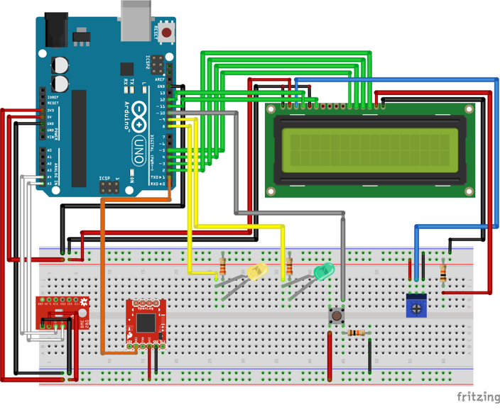
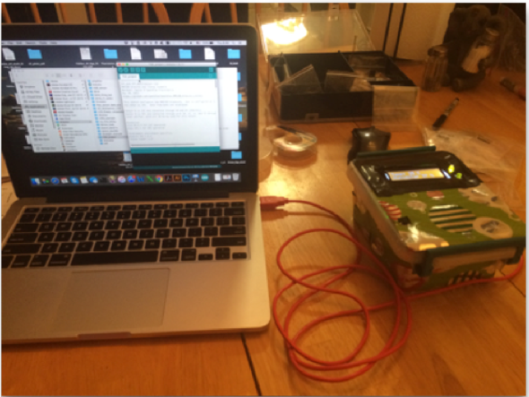

.. _valdez_robert_2016:

Laboratory Temperature and Humidity Monitoring System - Robert Valdez
=====================================================================

**The problem**

Small variations in both temperature and humidity have been known to disrupt
and/or influence various laboratory-based parameters that are at the core of
rock and sediment mechanics research. More specifically, we often observe 1)
temperature-based fluctuations in pore fluid pressure during long-term (i.e.
weeks to months) deformation and consolidation experiments and 2) humidity-based
changes in frictional behavior during short-term (i.e. a few to several hours)
unconfined shearing experiments. This project aims to continuously monitor the
ambient conditions in our laboratory to help improve the quality of our data.

**Instrumentation and setup**

The main components required for this project are all readily available from
`SparkFun <https://www.sparkfun.com>`_ and are as follows:

a.	`Sparkfun RedBoard <https://www.sparkfun.com/products/12757>`_
b.	`Atmospheric Sensor <https://www.sparkfun.com/products/13676>`_
c.	`LCD screen <https://www.sparkfun.com/products/709>`_
d.	`LED lights <https://www.sparkfun.com/products/12062>`_
e.	`10k ohm resistors <https://www.sparkfun.com/products/11508>`_
f.	`330 ohm resistors <https://www.sparkfun.com/products/11507>`_
g.	`10k trimpot <https://www.sparkfun.com/products/9806>`_
h.	`push button <https://www.sparkfun.com/products/12992>`_
i.	`Jumper wires <https://www.sparkfun.com/products/11026>`_

All of the components listed above, excluding the atmospheric sensor, can be
obtained by purchasing the sparkfun inventors kit.

The electrical build (Figure 1a) is rather straightforward, with all of the
components being controlled by the RedBoard. The 16x2 LCD screen and the
pushbutton shown in the schematic are required to display the various parameters
(temperature, humidity, atmospheric pressure, and altitude) measured from the
atmospheric sensor.  The main parameters (i.e. temperature and humidity) are
shown on the LCD screen as the default setting, but when the pushbutton is
active the text on the screen changes to pressure and altitude. The primary
function of the LED lights is to notify the user when the system is successfully
running (solid green light) and to show the output rate of the atmospheric
sensor (yellow blinking light). This system is then placed in an enclosure to
allow for mobility and easy deployment into different environments (Figure 1b).

   Figure 1a - Schematic of the electrical circuit for this project.

  Figure 1b - Picture of the system being connected to a computer with a USB cord.

**Results**

An example of data collected from this setup is shown below (Figures 2-3).

To test the functionality of this system, I exposed the atmospheric sensor to
different temperature and humidity conditions. This took the form of a common
freezer and conventional oven. Not surprisingly, the temperature starts to
decrease with time then increase once the ambient conditions were changed (i.e.
from the freezer to the oven). The relative humidity shows a similar pattern,
with low values in the freezer and higher values near the oven. The drastic
increase in humidity could also be a result of condensation build up in the
enclosure after exposing it higher temperatures.

  Figure 2 - Temperature recording over 1 hr time window. The monitoring system was exposed to cold (freezer) followed by warm temperatures (oven).

  Figure 3 - Relative humidity recording over the same 1 hr time window.

**Challenges**

The challenges encountered in this project mainly revolved around 1) failure to
implement other instruments into this monitoring system and 2) coding errors. I
was not able to successfully implement the data-logging instrument into the
system (i.e. https://www.sparkfun.com/products/13712), which made this system a
“monitoring” rather than a “logging” system. However, I was able to actively
record the output of the atmospheric sensor using the CoolTerm application. This
application (http://freeware.the-meiers.org) allows the user to connect to the
monitoring systems serial port and write its output to a text file. The data
shown in Figures 2-3 were collected using this software while the systems was
running.  The coding errors are also linked to the data-logging instrument
problem in that I was not able to successfully get these different components to
sync with each other.

**Future work**

As part of my future work, I plan to address the challenges listed above.
Specifically, I’d like to record data without actively using an outside
application. Once the system is successfully recording data, I’d like to
implement a wifi module so that this data is readily available online. This can
be completed using the SparkFun Thing (https://www.sparkfun.com/products/13231),
which allows the user to upload data to a server (i.e.
https://data.sparkfun.com/). Once it is available online, I’ll plot this data in
real time so that others experimentalists at Penn State can view the temperature
and humidity logs at their leisure. Lastly, I’d like to have this completely
battery powered so that it is no longer tied to a computer.

Media
-----
:download:`Slides (PDF) <valdez_presentation.pdf>`

:download:`Slides (Keynote) <valdez_presentation.key>`

.. raw:: html

 

 <iframe width="560" height="315" src="https://www.youtube.com/embed/XbewWOvOvog" frameborder="0" allowfullscreen>
 </iframe>
 

