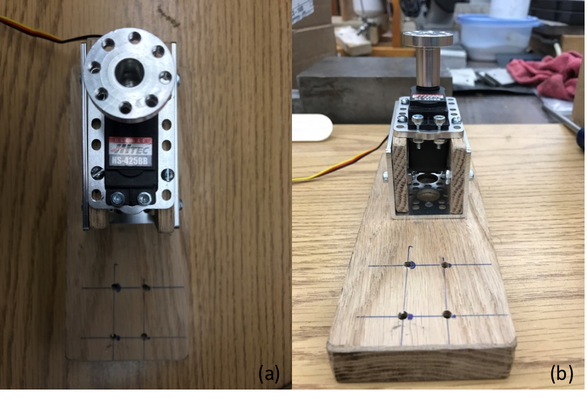

.. _wang_chaoyi_2016:

Deformation-measuring Module  - Chaoyi Wang
============================================

**Abstract**

A simple force measuring automation system is constructed to measure the
deformation (strain) from a wooden cantilever bar structure. The system consists
of two Arduino Uno boards with corresponding circuits, a servo motor connected
to a wooden arm, and a cantilever-shaped load frame, a wooden bar is then pulled
by the servo motor via the wooden bar through an elastic string. Specifically,
one Arduino Uno board is programed to control the servo motor, the other Arduino
Uno board is programed to register strain signals from the attached strain
gages; the motion pattern of the servo motor can be either controlled by the
swipe potentiometer or by pre-written scripts on computer; the strain gages are
constructed with full-bridge configuration. As the servo motor pulling the
wooden bar, the deformation and resultant force can be either observed from the
LCD display on the Arduino Uno board or from the computer screen. This simple
force-deformation measuring system is programed to be easily expanded and
improved should there are more complicated applications.

**Introduction**

We measure all kinds of mechanical quantities in the rock mechanics lab, for
instance, force, displacement, and acceleration, etc. Most of the measurement
systems contain sensors and data acquisition systems. However, most systems are
not self-sustainable, which means carrying out different test procedures
automatically according to a pre-set scheme, giving out warning/shutting down
the system automatically when necessary, and pushing notifications of test
status to operators if the operator is not on site. Such automation is needed
especially in long-duration experiments such as creep shear and
slide-hold-slide.

Through this semester, we have learnt how to construct experimental apparatus
from scratch, including building both hardware and software parts of the
apparatus, signal conditioning, and data acquisition. In this project, a simple
force measuring automation system is put together using the techniques learned
from the class. The system consists of two major parts, hardware and software.
The hardware part is composed of two Arduino Uno boards with preconnected
circuits (one board controlling the servo motor, the other serve as a signal
conditioner and data logger), a wooden load frame, a servo motor with a
customized wooden arm, and a subject wooden bar which can be deformed by the
servo motor. The software part is a piece of self-written program (LabVIEW),
this program features functionalities of data displaying, conditioning,
recording, and performing schematic loading sequences.

Combining the hardware and software part, this simple force-deformation
measuring system is a prototype of more comprehensive-complicated experimental
set ups used in rock mechanics laboratories. The system can be easily modified
and expanded for additional functionalities.

**Apparatus Configuration**

Part 1. Hardware

(1)	Load frame

The load frame is constructed out of oak and pine strips purchased from Lowe’s.
The completed frame is shown in Figure 1.

  Figure 1. Load frame: the material of the bottom piece is oak wood; an aluminum
  servo motor holder is fixed by two screws on the bottom piece; the servo motor
  is hosted by a bracket and sandwiched between two pine plates as shown; the
  whole sandwich structure is then attached on the servo holder (a larger bracket)
  via two bolts on each side.

There is a bar holder also fixed on the bottom piece, this triangular shaped bar
holder is made by 3-D printing (Figure 2), the design is fairly simple, the
holder consists of two plates sitting perpendicular to each other with a
supporting rib connecting each other. Since this part is 3-D printed, therefore
the constructing material is filler plastic. One may question the stiffness of
this bar holder due to its material, however, as we are going to deform a thin
pine wood bar, the rib could provide adequate stiffness and support in this
specific application discussed here.

  Figure 2. 3-D printed bar holder: (a) Onshape model of the bar holder; (b) 3-D
  printed sample holder.

(2)	Wooden bar and strain gage configuration

The subject we are going to deform (bend) in this application is a pine wood bar
(Figure 3). The dimension of the bar is NNxNNxNN. Four bolts are used to fix the
wood bar to the bar holder though the configuration shown in Figure 3.

  Figure 3. Pine wood bar used in this application: full-bridge configured strain
  gages are attached on the upper portion of the wood bar; four bolts are used to
  fix the lower portion of the wood piece firmly on to the bar holder.

(3)	Servo motor

The model of the servo motor is Hitec HS-425BB (see the appendix for the link to
the data sheet), the motor in assembly is shown in Figure 4. The maximum torque
of this servo motor is 45.82/56.93 oz-in (4.8/6.0V).

  Figure 4. Servo motor used in this project: (a) top view of the servo motor
  mounted in bracket; (b) side view of the servo motor mounted in the bracket.

(4)	Arduino Uno Board

There are two Arduino Uno boards used in this application, one Arduino board
(AB1) is configured to control the servo motor and features a switch function
from manual mode and programmed mode. To be specific, one can control the servo
motor by slide the swipe potentiometer (voltage divider circuit) associated with
the circuit, or control the servo motor by a set of pre-defined command scripts
using serial communication. The other Arduino board (AB2) is configured as a
signal amplifier and can register data to a personal computer. The two Arduino
boards and the corresponding circuit is shown in Figure 5.

  Figure 5. Arduino boards and corresponding circuit diagrams: (a) AB1, this
  Arduino is used to control the servo motor in manual mode (use the swipe
  potentiometer) or in automatic mode; (b) AB2, this Arduino board is used to
  acquire analog signal, amplify the signal, convert the analog signal to digital
  bits, and register the digital data onto a local computer.

Part 2. Software

(1)	Data acquisition program

The data acquisition program “one_channel_serial_reader.vi” is written in
LabVIEW 2015, the front control panel and the block diagram is shown in Figure 6
and Figure 7. This program can record data from the load frame to the local
computer, and can read a script containing instructions for the servo motor to
move.

  Figure 6. Front control panel of “one_channel_serial_reader.vi”.

  .. figure:: ./images/Fig7.png
    :align: center
    :scale: 100 %

    Figure 7. Block diagram of “one_channel_serial_reader.vi”.

(2)	Servo motor control module

The servo motor is controlled either manually or by reading a pre-written file
containing instructions to the motor. In the manual mode, the servo motor will
rotate according to how much voltage is divided by the swipe potentiometer. The
potentiometer is set in a voltage divider circuit, as shown in Figure 8, and the
range of voltage measured from the two ends of the potentiometer is
approximately 0 to 4.95 V.

If automatic control mode is chosen, the program will execute instructions form
the command file one at a time according to a user-defined execution interval.

**Experimental Performance**

Part 1. Loading manually by a swipe potentiometer

By sliding the swipe potentiometer, the Arduino board will convert the voltage
measured from the voltage divider circuit and map the value to a range of 0 to
180 degrees. The position instruction is then send to the servo motor to
execute. The rotation of the motor is continuous, since the resistant change in
the swipe potentiometer is continuous. The LCD display will display the
approximate angle the motor has rotated. Figure 8 shows an image of LCD display
while the motor is rotating in manual mode.

  Figure 8. Servo motor rotates in manual mode.

Part 2. Loading automatically by a pre-written script

When choosing the automatic mode, the “one_channel_serial_reader.vi” program
will read a text file containing serial commands to the motor. The commands are
composed of a simple absolute degree value followed by a semi-column as a
delimiter. A sample command file is shown in Figure 9.

  Figure 9. Sample command file “serialcommand_test.txt”: the file is composed of
  multiple lines of commands; each command contains a rotational degree value and
  a semi-column as a delimiter.

Part 3. Automatic shut down and overstress shut down threshold

The program can shut down by itself if certain criteria are met, such criteria
are listed as following:

1.	The scheduled experimental time has been exhausted.
2.	The deformation reading exceeds either the pre-set upper limit or lower limit.
3.	Should any internal program error occur.
4.	The emergency stop button is pressed.

**System Expandability**

This system is a simple combination of hardware and software design in rock
mechanics experimentation. The system can be easily modified or expanded either
from software or hardware. The following example expansion scenarios are
described:

1. Hardware: the servomotor can be replaced by an actuator or continuous motor
   in different applications.
2. Hardware: the wooden bar can be any material of interest such as rocks,
   polys, and metals. Under the assurance of higher stiffness of the sample holder.
3. Software: timing modules can be expanded to accommodate not only uniform time
   interval executions but non-uniform timing schemes.
4. Hardware and software: a cellular module can be added to the Arduino board 2,
   this cellular module can be programed to send out messages/emails to operator if
   the operator is not present onsite during automatic runs.

There are many more possibilities for this system to be expanded, however, due
to the limited amount of resources, not all of them are described or addressed
here.

**Summary**

In this specific application, a simple comprehensive automation system is built
to accommodate the purpose of deformation measurements. The system consists of a
hardware part and a software part, For the hardware part: a wooden arm driven by
a servo motor pulls a wooden bar with an elastic string manually or
automatically; the wooden bar is mounted on a 3-D printed bar-holder;
full-bridge configured strain gages attached on the wooden bar are used to
measure the induced deformation. For the software part: a LabVIEW program is
developed to establish communication between the Arduino boards and a local
computer; the program can register and record the deformation readings from the
load measuring cell and control the servo motor by sending serial commands to
the corresponding serial ports.

**Acknowledgements**

Hereby I want to express my sincere acknowledgements to Dr. Chris Marone and
course instructor Dr. John Leeman for their patient instructions and inspiring
lectures. And all people in the rock mechanics lab who tolerated me for doing
wood work and making mess around.

Media
-----
:download:`Slides (PDF) <wang_presentation.pdf>`

:download:`Code (ZIP) <wang_code.zip>`

.. raw:: html

 

 <iframe width="560" height="315" src="https://www.youtube.com/embed/OltvilmxuQ8" frameborder="0" allowfullscreen>
 </iframe>
 

